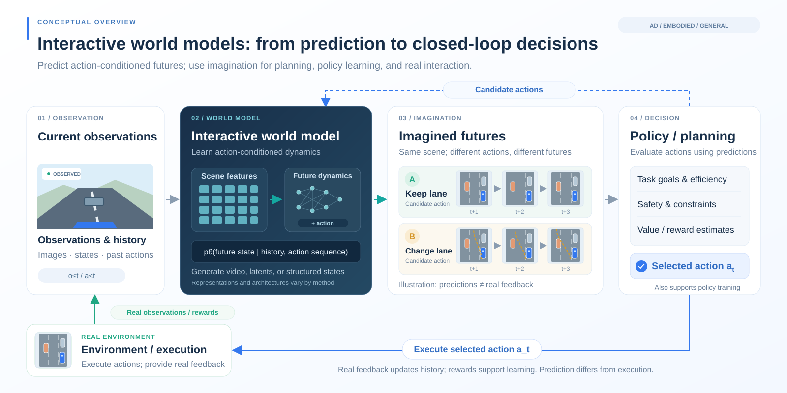
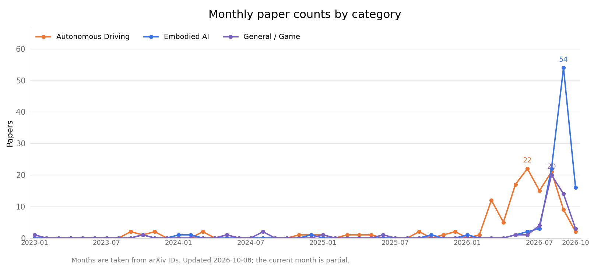

<!-- ============================================================ -->
<!-- Generated from data.yaml by scripts/generate_readme.py; do not edit manually. -->
<!-- ============================================================ -->

# Awesome Interactive World Models

[简体中文](README.md) | **English**

> Interactive world models for autonomous driving and embodied AI

World models learn dynamic representations of their environments to predict and imagine the future. Interactive world models further support action-conditioned generation and control, providing data engines, neural simulators, and a foundation for policy learning in autonomous driving and embodied AI. This repository collects representative work, organized by application domain and annotated with its interactive capabilities.

📊 **277** papers collected | Last updated: 2026-10-08

  

  

## Interactive capabilities

| Icon | Meaning |
| :---: | :--- |
| 🎮 | Action-conditioned generation |
| ⚡ | Real-time inference |
| 🔁 | Closed-loop support |
| ⏳ | Long-horizon consistency |

## Contents

- [Autonomous Driving](#autonomous-driving) (123)
- [Embodied AI](#embodied-ai) (104)
- [General / Game](#general--game) (50)

## Autonomous Driving

| Paper | Publication | Organization | Capabilities | Links | Summary |
| :--- | :--- | :--- | :---: | :--- | :--- |
| **4D-WAM**: 4D Consistent World Modeling for Autonomous Driving | arXiv (2026) | Zhiwei Xiong team | — | [Paper](https://arxiv.org/abs/2608.10107) | Uses a geometry foundation model to provide 4D-consistency supervision, with decision-oriented timestep sampling strengthening planning. |
| **A Risk-Field Enhanced Closed-Loop Digital Twin Framework for Autonomous Driving Safety Validation** | arXiv (2026) | Yongzhi Liu team | 🔁 | [Paper](https://arxiv.org/abs/2607.09772) | A risk-field-driven closed-loop digital twin framework that unifies risks from obstacles, lane departure, and time to collision for policy training. |
| **AD-E2E-JEPA**: A Joint-Embedding Predictive Architecture For End-to-End Autonomous Driving | arXiv (2026) | New York University / AMI | 🎮 | [Paper](https://arxiv.org/abs/2609.34085) \| [Code](https://github.com/HaoranZhuExplorer/AD-E2E-JEPA) | An action-conditioned JEPA uses future images as targets and selects trajectories zero-shot from a trajectory vocabulary, without training a driving policy. A learnable projection reduces planning patches to 1/16 and their dimensions to 1/4, making inference approximately 100 times faster; an 8-frame rollout with 256 candidates takes approximately 0.8 seconds. For goals averaging over 20 meters away, displacement error is 4.0 meters with 256 candidates and 2.8 meters with 8192. On 100 NAVSIM v2 scenarios, zero-shot planning achieves 67.3/72.9 EPDMS (with the safety product term) and 84.1/86.5 EPDMS†; reusing the self-supervised projection for imitation learning increases EPDMS from 80.2 to 85.4. |
| **ADV-0**: Closed-Loop Min-Max Adversarial Training for Long-Tail Robustness in Autonomous Driving | arXiv (2026) | Jian Sun team | 🔁 | [Paper](https://arxiv.org/abs/2603.15221) | Combines a zero-sum Markov game with iterative preference learning to approximate the optimal adversary distribution, with attacker-defender co-evolution. |
| **AlignADV**: Learnability-Guided Adversarial Training for Safe Autonomous Driving | arXiv (2026) | Jian Sun team | — | [Paper](https://arxiv.org/abs/2606.14032) | Combines preference-aligned generation of solvable scenarios with capability prediction from behavioral fingerprints, reducing training steps by 40.6% through dynamic curriculum sampling. |
| **AnchorDrive**: LLM Scenario Rollout with Anchor-Guided Diffusion Regeneration | arXiv (2026) | Chen Xiong team | — | [Paper](https://arxiv.org/abs/2603.02542) | Uses LLM closed-loop driver agents to generate anchors, followed by diffusion regeneration of complete trajectories, balancing controllability and realism. |
| **AnyScene**: Towards Highly Controllable Driving Scene Generation at Anywhere and Beyond | arXiv (2026) | Benjin Zhu team | — | [Paper](https://arxiv.org/abs/2605.26113) | An occupancy-centric unified framework that autoregressively generates occupancy sequences and multi-view driving videos from BEV layouts. |
| **BeyondSight**: Object Permanence for End-to-End Autonomous Driving | arXiv (2026) | Steven L. Waslander team | — | [Paper](https://arxiv.org/abs/2607.09138) | Decouples existence from observability, using temporal propagation of actor queries for perception, prediction, and planning under occlusion. |
| **BrainWAM**: Action-Space Coordination of Semantic Priors and Predictive Dynamics for Autonomous Driving | arXiv (2026) | Zhaoxiang Zhang team | — | [Paper](https://arxiv.org/abs/2608.12854) | Uses a structured action space to coordinate specialized pathways for semantic reasoning and predictive world modeling, achieving state-of-the-art results on NAVSIM. |
| **CARS**: Learning Responsibility-Attributed Adversarial Scenarios for Testing Autonomous Vehicles | arXiv (2026) | Cheng Wang team | — | [Paper](https://arxiv.org/abs/2605.13751) | Combines context-aware adversary selection with adversarial policy generation, producing collision scenarios with responsibility attribution and regulatory alignment. |
| **CCFM**: Collision-Constrained Flow Matching for Safety-Critical Scenario Generation | arXiv (2026) | Ruwen Qin team | — | [Paper](https://arxiv.org/abs/2607.04451) | Defines four collision types with hard constraints, combining flow matching and Gauss-Newton projection to ensure controllable collision types. |
| **CLEAR**: Closed-Loop Reinforcement Learning at Scale for End-to-End Autonomous Driving | arXiv (2026) | Fatih Porikli team | 🔁 | [Paper](https://arxiv.org/abs/2607.02841) | Combines a residual waypoint policy with a heterogeneous simulation pipeline, achieving state-of-the-art results on Bench2Drive and CARLA longest6. |
| **CMU-Drive and V2V-VLA: Cooperative Multi-agent Unified Driving with Reasoning Benchmark** | arXiv (2026) | Stephen F. Smith team | 🔁 | [Paper](https://arxiv.org/abs/2608.07621) | The first multi-vehicle cooperative closed-loop end-to-end driving benchmark and the V2V-VLA model, jointly generating actions, waypoints, reasoning, and communication. |
| **Cam2Sim**: Neural Scenario Reconstruction for Closed-Loop Autonomous Driving Simulation | arXiv (2026) | Andrea Stocco team | 🔁 | [Paper](https://arxiv.org/abs/2607.04770) | Reconstructs real driving videos into CARLA scenarios that support closed-loop execution, using Gaussian splatting rendering to reduce the visual simulation gap. |
| **CausalDrive**: Real-time Causal World Models for Autonomous Driving | arXiv (2026) | Xiaomi | 🎮 ⚡ | [Paper](https://arxiv.org/abs/2606.15341) | A real-time causal video world model that autonomously generates surrounding vehicles' responses using only an initial image, ego trajectories, and macrosociological prompts. |
| **CoWorld-VLA**: Thinking in a Multi-Expert World Model for Autonomous Driving | arXiv (2026) | Gong Che team | — | [Paper](https://arxiv.org/abs/2605.10426) | Combines four types of expert tokens, for interaction, geometry, evolution, and trajectories, with a diffusion-based hierarchical-fusion planner. |
| **CommonRoad-Game**: A Human-in-the-Loop Simulation Framework for Autonomous Driving | arXiv (2026) | Youran Wang team | 🔁 | [Paper](https://arxiv.org/abs/2607.01382) | A lightweight human-in-the-loop driving simulation framework using multithreaded synchronization for interactive scenario generation and planning tests. |
| **Conditional Flow-VAE for Safety-Critical Traffic Scenario Generation** | arXiv (2026) | Raquel Urtasun team | — | [Paper](https://arxiv.org/abs/2605.04366) | Uses conditional latent flow matching to transform nominal scenario distributions into safety-critical rollouts. |
| **DA-WAM: Decision-Aligned Future Latents for Driving World Models** | arXiv (2026) | HKUST Jun Ma team | 🎮 | [Paper](https://arxiv.org/abs/2608.19085) | Improves driving-world-model performance by aligning trajectories with future representations. |
| **DLWM**: Dual Latent World Models enable Holistic Gaussian-centric Pre-training in Autonomous Driving | arXiv (2026) | Shaojie Shen team | — | [Paper](https://arxiv.org/abs/2604.00969) | Uses dual latent world models, with occupancy and planning streams, for Gaussian-centric autonomous-driving pre-training. |
| **DecoupleGS**: Interactive 3D Gaussian Splatting for End-to-End Autonomous Driving Testing | arXiv (2026) | Haotian Shi team | ⚡ 🔁 | [Paper](https://arxiv.org/abs/2608.01761) | Decouples static and dynamic Gaussian splatting to provide a high-fidelity, real-time closed-loop sensor simulation platform for end-to-end autonomous driving. |
| **Dreamer-SAC**: Off-Policy Learning in Latent World Models for Sample-Efficient Autonomous Driving | arXiv (2026) | Xi Xiong team | 🎮 | [Paper](https://arxiv.org/abs/2608.10386) | Combines a recurrent state-space world model, off-policy SAC, and n-step estimation to improve sample efficiency in autonomous driving. |
| **DriveCache**: Action-Aware Caching for Driving World Model Inference | arXiv (2026) | Jianchun Yang team | 🎮 | [Paper](https://arxiv.org/abs/2608.16354) | An action-aware KV caching strategy for diffusion driving world models that reuses spatially invariant features across multi-step denoising, substantially improving generation throughput. |
| **DriveCombo**: Benchmarking Compositional Traffic Rule Reasoning in Autonomous Driving | arXiv (2026) | Kaicheng Yu team | — | [Paper](https://arxiv.org/abs/2603.01637) | A compositional traffic-rule reasoning benchmark evaluating driving systems' understanding of complex rules. |
| **DriveFix**: Spatio-Temporally Coherent Driving Scene Restoration | arXiv (2026) | Qi Guo team | — | [Paper](https://arxiv.org/abs/2603.16306) | Uses an interleaved diffusion Transformer to model temporal dependencies and cross-camera consistency for 4D driving-scene restoration. |
| **DrivePTS**: A Progressive Learning Framework for Driving Scene Generation | arXiv (2026) | Cheng Lu team | — | [Paper](https://arxiv.org/abs/2602.22549) | Uses progressive learning to decouple dependencies on geometric conditions, with VLM multi-view descriptions and a frequency-structure loss improving scene-generation fidelity. |
| **DriveWAM**: Video Generative Priors Enable Scalable World-Action Modeling for Autonomous Driving | arXiv (2026) | Li Jiang's team | 🎮 | [Paper](https://arxiv.org/abs/2605.28544) | Adapts a pre-trained video diffusion Transformer into an autoregressive video-action policy, guided by scene-evolution semantics. |
| **DriveWeaver**: Point-Conditioned Video Inpainting for Controllable Vehicle Insertion in Autonomous Driving Simulation | arXiv (2026) | Li Zhang team | — | [Paper](https://arxiv.org/abs/2606.31918) | Uses point-cloud-conditioned video inpainting for controllable vehicle insertion, and extracts 3DGS for real-time rendering. |
| **DynamicVGGT**: Learning Dynamic Point Maps for 4D Scene Reconstruction in Autonomous Driving | arXiv (2026) | Xiangyang Xue team | — | [Paper](https://arxiv.org/abs/2603.08254) | Extends VGGT to dynamic 4D, jointly predicting current and future point maps and introducing motion-aware attention. |
| **Dynasto**: Validity-Aware Dynamic-Static Parameter Optimization for Autonomous Driving Testing | arXiv (2026) | Foutse Khomh team | — | [Paper](https://arxiv.org/abs/2603.21427) | Combines RL adversaries, temporal-logic validity, and genetic-algorithm search for initial conditions, increasing the valid failure rate by 60-70%. |
| **E2E-CDiff**: End-to-end Conditional Diffusion for Realistic and Controllable Visual Traffic Scenario Generation | arXiv (2026) | Philip S Yu team | 🎮 | [Paper](https://arxiv.org/abs/2607.18637) | Jointly denoises motion states and low-level controls under forward-view conditioning, supporting interactive scenario generation for collision avoidance or collision guidance. |
| **ECoSim**: Data Efficient Fine-Tuning for Controllable Traffic Simulation | arXiv (2026) | Masayoshi Tomizuka team | — | [Paper](https://arxiv.org/abs/2607.00545) | Uses FiLM layers to lightly adapt pre-trained traffic models, achieving multimodal controllable simulation with <1% of the data. |
| **EditSSC**: Toward Editable Semantic Occupancy Scenes with Unconditional Diffusion Models | arXiv (2026) | Alexandre Boulch team | — | [Paper](https://arxiv.org/abs/2606.09273) | Reorganizes 3D semantic occupancy as BEV images and uses an off-the-shelf latent diffusion network to generate editable occupancy scenes. |
| **EditWM**: Event-Decomposed World Modeling with Incremental Correction for End-to-End Autonomous Driving | arXiv (2026) | HKUST / Southern University of Science and Technology | 🎮 | [Paper](https://arxiv.org/abs/2609.22317) | First predicts routine scene evolution and freezes the predictor, then applies gated, magnitude-limited corrections to event-induced deviations; the corrected features score candidate trajectories. Across all 12,146 NAVSIM navtest scenarios, future-feature error under expert-trajectory conditioning is 5.35% lower than with routine prediction alone, 83.54% of scenarios improve, and the planning score is 91.05 EPDMS. |
| **Ego-Dynamics-Augmented World Model for Autonomous Driving with Zero-Shot Cross-Chassis Adaptation** | arXiv (2026) | Chen Lv team | — | [Paper](https://arxiv.org/abs/2607.13410) | Uses explicit ego-dynamics priors to decouple a BEV world model, supporting zero-shot transfer across chassis. |
| **EvoDrive**: Pareto Evolution for Safety-Critical Autonomous Driving via Self-Improving LLM Agents | arXiv (2026) | Wei Ma team | — | [Paper](https://arxiv.org/abs/2606.03678) | Combines a simulation-anchored actor-critic with self-evolving evaluator routing, using a Pareto archive to preserve the attack-realism trade-off. |
| **FlashDrive**: Flash Vision-Language-Action Inference for Autonomous Driving | arXiv (2026) | Zhijian Liu team | ⚡ | [Paper](https://arxiv.org/abs/2608.12932) | Uses algorithm-system co-design to compress four levels of VLA bottlenecks, increasing the inference speed of a 10B model from 1.4 Hz to 6.6 Hz. |
| **ForeDrive**: Foresight-Guided End-to-End Autonomous Driving with a Planning-Relevant Latent World Model | arXiv (2026) | Huazhong University of Science and Technology / Shanghai Zaofu / Tongji University | 🎮 | [Paper](https://arxiv.org/abs/2609.26299) | A JEPA-style latent world model predicts multi-step visual and ego states, which directly condition a diffusion planner. Planning gradients update only the shared encoder; gradients to the predictor are stopped, and the predictor is trained only with the prediction loss. Inference uses only the current front view, with pure imitation learning, no reinforcement learning, and no external scorer. NAVSIM v1 results are 89.9 PDMS, or 90.4 with the larger ViT-L; single-stage v2 achieves 90.0 EPDMS. |
| **D-V2S**: From Driving Videos to Simulatable Scenarios | arXiv (2026) | Antonio Manuel López team | — | [Paper](https://arxiv.org/abs/2606.21993) | Combines VLM-generated scene descriptions with LLM conversion to executable scripts, converting videos into simulatable scenarios with 90% semantic-element coverage. |
| **FrozenDrive**: Zero-Shot Text-Guided Driving Scene Generation with Parameter-Free Frozen Diffusion | arXiv (2026) | Kuk-Jin Yoon team | — | [Paper](https://arxiv.org/abs/2606.20110) | Combines a frozen diffusion backbone with knowledge-preserving spatiotemporal attention for zero-shot generation of multi-view-consistent driving scenes. |
| **GEM**: Gaussian Evolution Model for Occupancy Forecasting and Motion Planning | arXiv (2026) | Saurabh Bagchi team | — | [Paper](https://arxiv.org/abs/2605.17682) | A non-autoregressive continuous 4D Gaussian occupancy world model supporting queries at arbitrary times and motion planning. |
| **GSDrive**: Reinforcing Driving Policies by Multi-mode Future Trajectory Probing with 3D Gaussian Splatting Environment | arXiv (2026) | Zufeng Zhang team | 🔁 | [Paper](https://arxiv.org/abs/2604.28111) | Probes multimodal trajectories in a differentiable 3DGS environment, converting simulation returns into dense rewards to shape end-to-end policies. |
| **GaussianDWM++**: Language-Grounded 3D Gaussian Driving World Model for Unified Scene Understanding, Editing, and Multi-Modal Generation | arXiv (2026) | Tianchen Deng team | 🎮 | [Paper](https://arxiv.org/abs/2608.16234) | A language-grounded 3D Gaussian driving world model unifying scene understanding, language reasoning, controllable 4D editing, and multimodal generation, addressing the lack of explicit 3D representations in existing methods. |
| **GeoWAM**: Visual Geometry World Action Models for Autonomous Driving | arXiv (2026) | Uber AV Labs / Case Western Reserve University | 🎮 🔁 | [Paper](https://arxiv.org/abs/2608.23486) \| [Project](https://yiren-lu.com/project_pages/geowam/) | Advocates using point-cloud geometry as the state space of driving world models rather than pixels. Pre-training predicts future scene geometry, and a geometry-conditioned action head then predicts ego trajectories; both open-loop and closed-loop evaluations significantly outperform image-based WAMs. |
| **GeoWM**: Efficient Direct World Modeling in Explicit Geometry | arXiv (2026) | Huawei Noah's Ark Lab | ⏳ | [Paper](https://arxiv.org/abs/2610.07381) | Directly predicts depth and 3D geometry at a specified horizon, without recursively rolling out images. Long-horizon AbsRel on KITTI decreases from 21.2 for Cosmos-3 to 17.4. Across all horizons on DOMINO, it decreases from 20.5 to 9.6, compared with 24.6 for VGGT-World trained on the same data. Inference takes 0.11 seconds at any horizon. Conditioning uses predicted camera motion; robot-action conditioning is left for future work. |
| **GraphWorld**: Long-Horizon Planning with World Models for End-to-End Autonomous Driving | arXiv (2026) | Yadan Luo team | ⏳ | [Paper](https://arxiv.org/abs/2606.16274) | Combines ego-centric interaction graphs with world-state-conditioned planning to reduce collisions and improve long-horizon planning. |
| **HERMES++**: Toward a Unified Driving World Model for 3D Scene Understanding and Generation | arXiv (2026) | Xiang Bai team | — | [Paper](https://arxiv.org/abs/2604.28196) | A driving world model unifying 3D scene understanding and future geometry prediction, using BEV and LLM-enhanced world queries. |
| **How Can Driving World Models Do Counterfactual Prediction?** | arXiv (2026) | Ziran Wang team | — | [Paper](https://arxiv.org/abs/2608.11601) | Formalizes the conditions under which driving world models can serve as counterfactual simulators, analyzing causal identifiability and estimation bias. |
| **HyWorldVLA**: A Vision-Language-Action Model with Hybrid World Modeling for Autonomous Driving | arXiv (2026) | Liulong Ma team | — | [Paper](https://arxiv.org/abs/2607.20988) | A hybrid world VLA unifying pixel-level supervision and latent representation learning, with the first noise-robustness analysis. |
| **IDOL**: Inverse-Dynamics-Guided Future Prediction for End-to-End Autonomous Driving | arXiv (2026) | Dongmei Li team | — | [Paper](https://arxiv.org/abs/2605.31476) | Uses inverse dynamics to bridge future prediction and trajectory optimization, translating scene evolution into executable motion increments. |
| **Instant NuRec**: Feed-Forward 3D Gaussian Reconstruction for Driving Scene Simulation | arXiv (2026) | NVIDIA | 🔁 | [Paper](https://arxiv.org/abs/2607.14203) | Converts multi-view driving logs into a simulatable 3DGS world in a single feed-forward pass, with reconstruction in 1.5 seconds and closed-loop compatibility. |
| **KG-ASG**: Collision-Knowledge-Guided Closed-Loop Adversarial Scenario Generation | arXiv (2026) | Qiang Liu team | 🔁 | [Paper](https://arxiv.org/abs/2605.18895) | Combines a collision knowledge base with a collision expert to infer primary and supporting adversary roles, using primary-support single-collider reasoning. |
| **L2D2-GS**: Learning to Densify for Feedforward Dynamic Gaussian Scene Reconstruction | arXiv (2026) | Wen Gao team | — | [Paper](https://arxiv.org/abs/2606.29374) | Combines self-supervised densification with geometric regularization for efficient feed-forward dynamic urban Gaussian reconstruction. |
| **LWDrive**: Layer-Wise World-Model-Guided Vision-Language Model Planning for Autonomous Driving | arXiv (2026) | Guofa Li team | — | [Paper](https://arxiv.org/abs/2606.29879) | Combines VLM coarse planning with a foresight-based cascaded planner for layer-wise refinement, incorporating future-frame generation supervision. |
| **Long-term Traffic Scene Prediction via Polynomial Representations in Autonomous Driving** | arXiv (2026) | Yue Yao team | ⏳ | [Paper](https://arxiv.org/abs/2608.03330) | Combines polynomial trajectory and map representations with diffusion generation to improve generalization and kinematic plausibility in long-term traffic-scene prediction. |
| **MDrive**: Benchmarking Closed-Loop Cooperative Driving for End-to-End Multi-agent Systems | arXiv (2026) | Jiaqi Ma team | 🔁 | [Paper](https://arxiv.org/abs/2605.10904) | A closed-loop cooperative driving benchmark with 225 scenarios that reveals the benefits and limitations of perception sharing and negotiation among multiple agents. |
| **Map-Agnostic Interactive Safety-Critical Scenario Generation via Multi-Objective Tree Search** | arXiv (2026) | Chen Sun team | — | [Paper](https://arxiv.org/abs/2603.03978) | Combines MCTS with a hybrid UCB/LCB strategy, using a map-agnostic SUMO microscopic model to generate interactive scenarios. |
| **Mitigating Compounding Error via Video Representation Regularization** | arXiv (2026) | Yisen Wang team | ⏳ | [Paper](https://arxiv.org/abs/2607.27036) | Reveals a link between error accumulation and representation dimensional collapse in autoregressive video world models, and introduces representation regularization to stabilize long-horizon generation. |
| **MomWorld**: Momentum-Aware Latent World Model for Long-Horizon Autonomous Driving | arXiv (2026) | Nanyang Technological University / Beijing Jiaotong University / North University of China / Dalian University of Technology / Tsinghua University | 🎮 ⏳ | [Paper](https://arxiv.org/abs/2609.33737) \| [Code](https://github.com/modaxiansheng/MomWorld) | Rolls scene momentum and configuration forward together: learnable persistence retains stable trends, scene-conditioned updates adjust future dynamics, and gates clear old momentum at abrupt changes. Momentum-conditioned flow matching then aligns reference trajectories with predicted scene evolution. On nuScenes, average collision rate over 1-6 seconds decreases by 12.2% relative to MomAD; at 6 seconds, L2 decreases from 2.45 meters to 2.31 meters and collision rate from 2.13% to 1.97%. |
| **OmniDreams**: NVIDIA OmniDreams: Real-Time Generative World Model for Closed-Loop Autonomous Vehicle Simulation | arXiv (2026) | NVIDIA | 🎮 ⚡ 🔁 ⏳ | [Paper](https://arxiv.org/abs/2606.03159) \| [Project](https://research.nvidia.com/labs/sil/projects/omnidreams-blog/) \| [Code](https://github.com/nv-tlabs/omni-dreams) | Uses mid-training and post-training of Cosmos over approximately 21,000 hours to produce an action-conditioned autoregressive driving-video world model. Generation is conditioned on past images, simulator states, and current driving actions, and runs in closed loop with Alpamayo 1 and AlpaSim. The 2B single-camera model reaches 68 FPS at 720p on one GB300; the four-camera version reaches 105 FPS on 16 GPUs. An approximately 2B world-action model post-trained with it reduces the collision rate on Physical AI NuRec from 6.9% for Alpamayo 1.5 (approximately 10B) to 4.2%. |
| **OWMDrive**: Causality-Aware End-to-End Autonomous Driving via 4D Occupancy World Model | arXiv (2026) | Yunfeng Ai team | — | [Paper](https://arxiv.org/abs/2606.30421) | Uses multi-step occupancy-world-model predictions as priors for diffusion planning, explicitly modeling spatiotemporal causal dependencies. |
| **OccDirector**: Language-Guided Behavior and Interaction Generation in 4D Occupancy Space | arXiv (2026) | Jianbing Shen team | ⏳ | [Paper](https://arxiv.org/abs/2604.22240) | Generates continuous multi-vehicle behaviors in 4D occupancy from natural-language scripts, using history-prefix anchoring to maintain long-term temporal consistency. |
| **World4Scorer**: Outcome-Grounded World Modeling for Autonomous Driving | arXiv (2026) | Institute for AI Industry Research, Tsinghua University / HKUST (Guangzhou) / Zhejiang University / Changan Automobile | 🎮 🔁 | [Paper](https://arxiv.org/abs/2609.36438) \| [Project](https://guobapei.github.io/World4Scorer/) \| [Code](https://github.com/GuobaPei/World4Scorer) | The scorer is a trajectory-conditioned JEPA: it predicts a state for each candidate trajectory and reads the score from that state. Simulation labels outcomes for all candidates, while the future from real logs anchors only the executed trajectory during training. Across all 12,146 NAVSIM test scenarios, it achieves 93.0 EPDMS on v2 and 94.0 PDMS on v1. Without inertia reranking, it achieves 91.4 EPDMS, compared with 90.7 for DrivoR under the same evaluation. Randomly swapping candidate states reduces PDMS from 94.19 to 79.73. On Bench2Drive, the system with modified inputs achieves a 73.27 Driving Score and a 46.36% success rate; the compared methods' training data and interfaces are not aligned. With LeWM and the planning budget fixed, OGBench-Cube success rate increases from 68.91% to 73.64%. |
| **PCASim**: Promptable Closed-loop Adversarial Simulation for Urban Traffic Environment | arXiv (2026) | Bin Jiang team | 🔁 | [Paper](https://arxiv.org/abs/2605.15654) | An LLM integrates knowledge-, data-, and adversarial-driven approaches, while RL trains safety agents, enabling adversarial scenarios and policies to co-evolve. |
| **PHASE**: Heterogeneous Self-Play for Realistic Highway Traffic Simulation | arXiv (2026) | Xiaoyu Huang team | — | [Paper](https://arxiv.org/abs/2604.16406) | Context-aware heterogeneous self-play policies with zero-shot transfer to 512 real highway interaction scenarios. |
| **PLAN-S**: Bridging Planning with Latent Style Dynamics for Autonomous Driving World Models | arXiv (2026) | Xinhu Zheng team | — | [Paper](https://arxiv.org/abs/2606.06014) | Decodes style-conditioned four-channel semantic cost maps from latent representations, bridging latent world models and planning. |
| **Physics-Aware 3D Gaussian Editing for Driving Scene Generation** | arXiv (2026) | Rui Ma team | — | [Paper](https://arxiv.org/abs/2605.25373) | Uses a single image to drive road-geometry insertion and couples it with vehicle dynamics for physics-aware 3DGS editing. |
| **Point as Skeleton: Accumulated Point Cloud Enhanced Autoregressive Generation for Closed-Loop AD Simulation** | arXiv (2026) | Junchi Yan team | 🔁 | [Paper](https://arxiv.org/abs/2607.06516) | Combines point-cloud skeleton conditioning with Reset-and-Roll diffusion inference for closed-loop driving video generation with state updates. |
| **Proposal-Conditioned Latent Diffusion for Closed-Loop Traffic Scenario Generation** | arXiv (2026) | Steven Peters team | 🔁 | [Paper](https://arxiv.org/abs/2606.27123) | Conditional diffusion with instance-centric context and multimodal proposal priors, using test-time guidance to shape safety-critical behaviors. |
| **RS2AD-LiDAR**: End-to-End Autonomous Driving LiDAR Data Generation from Roadside Sensor Observations | arXiv (2026) | Keqiang Li team | — | [Paper](https://arxiv.org/abs/2605.23406) | Generates LiDAR data usable for end-to-end autonomous driving from roadside sensor observations. |
| **Reciprocal WAM**: ReWAM: Reciprocal World Action Models for Interactive Autonomous Driving | arXiv (2026) | HKUST (Guangzhou) / Leapmotor / HKUST | 🎮 | [Paper](https://arxiv.org/abs/2609.39245) \| [Code](https://github.com/LeapWM/rewam) | The ego vehicle and other traffic participants act as mutually conditioned responders. Level-k action DiTs exchange policy tokens and share representations of the future driving world. Across 12,146 NAVSIM navtest scenarios, PDMS is 90.6, exceeding the DriveLaW backbone by 1.5 and ReWorld by 0.2. Increasing inference depth from Level-1 to Level-4 raises PDMS from 90.03 to 90.64. When grouped by interaction intensity, the advantage over DriveLaW increases from 1.52 for no interaction to 4.59 for critical interactions. |
| **Real2Sim**: A Physics-driven and Editable Gaussian Splatting Framework for Autonomous Driving Scenes | arXiv (2026) | Ruimin Ke team | — | [Paper](https://arxiv.org/abs/2605.13591) | Combines 4DGS with a differentiable material point method for physics-aware driving-scene synthesis, supporting instance-level editing and post-collision trajectories. |
| **RealWeather**: Realistic and Scene-Faithful Weather Translation with Driving World Models | arXiv (2026) | Guanbin Li team | — | [Paper](https://arxiv.org/abs/2608.02953) | Combines progressive realism bootstrapping and scene-faithful reinforcement learning optimization for bidirectional weather translation with driving world models. |
| **RealityBridge**: Bridging Editable 3D Gaussian Splatting Driving Simulations and Real-World Videos | arXiv (2026) | Guanbin Li team | — | [Paper](https://arxiv.org/abs/2606.16278) | Combines a video foundation model with adaptive GateNet injection to turn edited 3DGS renderings into realistic driving videos. |
| **Relational LAW**: Relationally Grounded Latent World Models for Autonomous Driving | arXiv (2026) | Freiburg / Esslingen | 🎮 | [Paper](https://arxiv.org/abs/2609.24626) | Builds traffic-participant-centric scene graphs from nuScenes 3D annotations on top of LAW, aligning visual latent states with the graphs' relational embeddings only during training. Scene graphs and 3D annotations are discarded at inference. Relative to retrained LAW, trajectory L2 decreases from 0.661 to 0.622 and the collision rate from 0.456 to 0.217; structured scene graphs outperform unstructured text descriptions. |
| **Risk-Controllable Multi-View Diffusion for Driving Scenario Generation** | arXiv (2026) | Jinhua Zhao team | — | [Paper](https://arxiv.org/abs/2603.11534) | Uses risk levels and physical risk modeling to drive multi-view diffusion, with region-aware DPO focusing on dynamic regions. |
| **RiskFlow**: Fast and Faithful Safety-Critical Traffic Scenario Generation | arXiv (2026) | Guofa Li team | — | [Paper](https://arxiv.org/abs/2606.06423) | Uses action-space transport and a JVP objective for single-forward-pass generation, with output-space guidance encouraging risk-taking by critical agents. |
| **SPHINX**: First Explain, Then Explore | arXiv (2026) | My T. Thai team | — | [Paper](https://arxiv.org/abs/2606.17482) | First uses explainable AI to analyze policy failures, then generates targeted adversarial scenarios to improve robustness. |
| **STADA**: Specification-based Testing for Autonomous Driving Agents | arXiv (2026) | Matthew B. Dwyer team | — | [Paper](https://arxiv.org/abs/2603.10940) | Systematically generates all initial scenarios and continuations from LTLf formal specifications, with twice the coverage of the best baseline. |
| **SaFeR**: Safety-Critical Scenario Generation via Feasibility-Constrained Token Resampling | arXiv (2026) | Jianxun Cui team | — | [Paper](https://arxiv.org/abs/2603.04071) | Generates adversarial scenarios through discrete next-token prediction, differential attention, and resampling constrained by a maximal feasible region. |
| **Safety-Centered Scenario Generation for Autonomous Vehicles** | arXiv (2026) | Aliasghar Moj Arab team | — | [Paper](https://arxiv.org/abs/2603.03574) | A HARA-driven parameterized safety-scenario framework that maps ISO 26262 safety goals. |
| **Scaling Self-Play for End-to-End Driving** | arXiv (2026) | Liam Paull team | 🔁 | [Paper](https://arxiv.org/abs/2606.19641) | Combines a high-throughput pixel-level self-play simulator with DAgger distillation of privileged teachers, without human trajectory supervision. |
| **Scenario Generation for Testing of Autonomous Driving Systems Using Real-World Failure Records** | arXiv (2026) | Chuchu Fan team | — | [Paper](https://arxiv.org/abs/2606.31131) | Uses categories and contextual information from NHTSA real-world crash records as inputs to an LLM that generates executable test scenarios. |
| **ScenePilot**: Controllable Boundary-Driven Critical Scenario Generation | arXiv (2026) | Cheng-zhong Xu team | — | [Paper](https://arxiv.org/abs/2605.21168) | Uses constrained multi-objective reinforcement learning with RSS physical feasibility and an online risk predictor to generate scenarios in a boundary band. |
| **Self-Aware AL**: Self-Aware Active Learning Enables Continual Improvement in Autonomous Driving | arXiv (2026) | Dimitrios Kanoulas team | — | [Paper](https://arxiv.org/abs/2608.29772) | Observes that driving systems mostly learn from passive experience and lack a mechanism for recognizing what they cannot do, leading to abrupt failures under rare distribution shifts and long-tail events. Proposes a self-aware active-learning framework that lets agents estimate their own capability gaps, seek timely human assistance, and turn incidental safety-critical encounters into learnable training signals for continual improvement. |
| **Sensor2Sensor**: Cross-Embodiment Sensor Conversion for Autonomous Driving | arXiv (2026) | Chiyu Max Jiang team | — | [Paper](https://arxiv.org/abs/2605.22809) | A generative approach that converts monocular driving videos from the web into multimodal sensor data comprising multi-view cameras and LiDAR. |
| **SimWAM**: A Simple World Action Model for End-to-End Autonomous Driving | arXiv (2026) | Xiang Bai team | — | [Paper](https://arxiv.org/abs/2608.07468) | Combines future-video supervision during training with isolating attention masks; inference requires no video generation and achieves 91.5 PDMS. |
| **SymRegFlow**: Symmetry-Regularized Flow Matching for Video World Models | arXiv (2026) | Tsinghua University / Bosch / University of Chinese Academy of Sciences | — | [Paper](https://arxiv.org/abs/2610.02726) | Fine-tunes a multi-view driving-video world model. Geometric warping produces noise anchors, and cross-anchor denoising consistency provides symmetry regularization, without ground-truth novel-view images during training. At midpoint views in 30 nuScenes validation scenes, joint generation achieves 158.62 FVD, compared with 231.95 for DiST-4D, the lowest among the compared baselines. Source-conditioned inference achieves 19.22 FID, compared with 20.60 for FreeVS. Conditioning uses camera poses. |
| **TerraTransfer**: Learning End-to-End Driving Policies Without Expert Demonstrations | arXiv (2026) | Wei Zhan team | 🔁 | [Paper](https://arxiv.org/abs/2606.17386) | Combines self-play pre-training in vector simulation with latent-space alignment of a visual backbone, learning driving policies without expert demonstrations. |
| **Threat-guided Policy-aware Scene Perturbation for Safe Autonomous Driving with Online Reinforcement Learning** | arXiv (2026) | Zongzhang Zhang team | — | [Paper](https://arxiv.org/abs/2608.10403) | A policy-aware scene encoder selects critical objects to perturb, with threat-guided generation producing safety scenarios of high training value. |
| **Toward the Cognitive-Physical Limits of Embodied Intelligence through a World-Model-Centric Autonomous Racing Agent** | arXiv (2026) | Chen Lv team | 🔁 | [Paper](https://arxiv.org/abs/2608.10618) | Learns a predictive world model from successes and failures at the limits, refining cognitive-physical boundaries in closed loop at 256.3 km/h. |
| **Towards Physically Consistent 4D Scene Reconstruction for Closed-loop Autonomous Driving Simulation** | arXiv (2026) | Shengbo Eben Li team | 🔁 | [Paper](https://arxiv.org/abs/2605.21032) | Uses orthogonal projected gradients and temporal regularization to address credit assignment between static and dynamic parameters, enabling physically consistent 4D reconstruction. |
| **TrafficAlign**: Aligning Large Language Models for Traffic Scenario Generation | arXiv (2026) | Tianyi Zhang team | — | [Paper](https://arxiv.org/abs/2606.29097) | Synthesizes scenarios from real videos and uses validation to align an LLM; the generated scenarios increase collision rates for three models by 10.8%. |
| **TrafficDiffuser**: Top-down Traffic Scenario Generation via Joint Initial-Goal Diffusion and Trajectory Infilling | arXiv (2026) | Sebastian Fischmeister team | — | [Paper](https://arxiv.org/abs/2608.11407) | High-level scenario generation that jointly models initial-goal state pairs, reducing trajectory generation to an infilling problem. |
| **UnsDrive**: Towards Robust End-to-End Autonomous Driving in Unstructured Scenes | arXiv (2026) | Yunfeng Ai team | 🔁 | [Paper](https://arxiv.org/abs/2608.09098) | An end-to-end planner for unstructured mining scenes, including an unknown-space occupancy representation and the MineLoop closed-loop simulator. |
| **VIScore**: Diagnosing Planning-Relevant Quality in Latent World Models | arXiv (2026) | Morgan Levine team | — | [Paper](https://arxiv.org/abs/2608.11174) | An evaluation score diagnosing planning-relevant quality issues in latent world models. |
| **VehDyn**: A Driving World Model Benchmark for Vehicle Dynamics | arXiv (2026) | The University of Texas at Austin / University of California, Berkeley | — | [Paper](https://arxiv.org/abs/2609.33264) | Pairs CARLA images with CarSim multibody dynamics in 10080 full-factorial configurations, synchronously recording position, velocity, and pose, and evaluates trajectory, kinematic, and dynamics consistency for 12 driving-video world models. Trajectory metrics for 10/12 models are already within 20% of ground truth, but no model reaches 92% of ground-truth dynamics consistency; visual quality and dynamics scores are only weakly correlated. DrivingWorld ranks highest, followed by Cosmos 3 Nano and LTX-Video 2.5. Data and metrics will be released after acceptance. |
| **WCog-VLA**: A Dual-Level World-Cognitive Vision-Language-Action Model for End-to-End Autonomous Driving | arXiv (2026) | Binyang Song team | — | [Paper](https://arxiv.org/abs/2607.08375) | Combines semantic-level world cognition and generative-level world evolution, with game-theoretic chain reasoning and multi-agent trajectory generation. |
| **World Engine**: Towards the Era of Post-Training for Autonomous Driving | arXiv (2026) | Hongyang Li team | 🔁 | [Paper](https://arxiv.org/abs/2606.19836) | Reconstructs high-fidelity interactive environments from real logs and extrapolates safety-critical variants to drive policy post-training. |
| **World Models as Adversaries: Multi-Agent Self-Play Fine-Tuning for Robust Motion Planning** | arXiv (2026) | Wei Ma team | — | [Paper](https://arxiv.org/abs/2607.10630) | Turns predictive world models into role-based adversaries, using counterfactual credit assignment to learn sparse adversarial coalitions. |
| **WorldDrive**: Bridging Scene Generation and Planning via Unifying Vision and Motion Representation | arXiv (2026) | Jianbing Shen team | — | [Paper](https://arxiv.org/abs/2603.14948) | A trajectory-aware driving world model unifying visual and motion representations, with a future-aware reward model selecting trajectories. |
| **Xiaomi Auto World Model: A Joint World Model Integrating Reconstruction and Generation for Autonomous Driving** | arXiv (2026) | Xiaomi | 🔁 | [Paper](https://arxiv.org/abs/2605.18137) | Integrates WorldRec feed-forward reconstruction and WorldGen causal video generation into a joint world model supporting closed-loop simulation. |
| **ZYT-World**: A Real-Time Controllable World Model for Closed-Loop Autonomous-Driving Simulation | arXiv (2026) | ZYT | 🎮 🔁 ⏳ | [Paper](https://arxiv.org/abs/2609.21712) \| [Project](https://zyt-aim.github.io/ZYT-World/) | Natively generates the vehicle's mixed camera rig: four fisheye views each exceeding 180 degrees and three pinhole views, preserving each camera's resolution. Conditioning combines ego motion, camera geometry, and traffic participants' boxes, headings, and traffic-light colors. A 40-step bidirectional teacher is distilled into a causal generator with one denoising step per frame, streaming seven 720p views at 4 FPS on two GPUs. Plug-and-play memory preserves scene identity when the vehicle returns to the same location along a different trajectory. On an internal test set, the one-step model retains more than 90% of the teacher's PSNR and SSIM, and the generator is 107.7 times faster. |
| **muSync-GS**: Physics-Synchronized Driving Video Synthesis for Weather and Geometric Road Hazards | arXiv (2026) | Zilin Bian team | — | [Paper](https://arxiv.org/abs/2608.04412) | Couples precipitation, tire friction, road elevation, and vehicle dynamics for physically synchronized driving video synthesis. |
| **AD-R1**: Closed-Loop Reinforcement Learning for End-to-End Autonomous Driving with Impartial World Models | arXiv (2025) | Jianbing Shen team | 🔁 | [Paper](https://arxiv.org/abs/2511.20325) | Constructs hazardous outcomes through counterfactual synthesis, using the world model as an internal critic for closed-loop policy post-training. |
| **GAIA-2**: A Controllable Multi-View Generative World Model for Autonomous Driving | arXiv (2025) | Wayve | 🎮 | [Paper](https://arxiv.org/abs/2503.20523) | A controllable multi-view driving world model that supports fine-grained control over scene attributes such as weather, geography, and traffic flow, providing a neural simulation environment for AV systems. |
| **LLM-attacker**: Using LLMs to Identify Adversarial Drivers for Testing Autonomous Vehicles | arXiv (2025) | Ye Tian team | — | [Paper](https://arxiv.org/abs/2501.15850) | Uses multiple LLM agents to identify traffic participants most suitable as attackers, then optimizes their trajectories to form iterative feedback. |
| **Nexus**: Decoupled Diffusion Sparks Adaptive Scene Generation | arXiv (2025) | Hongyang Li team | — | [Paper](https://arxiv.org/abs/2504.10485) | Uses decoupled diffusion for adaptive scene generation and interactive scene modeling at the behavioral level. |
| **Omega**: Optimization-Guided Diffusion for Interactive Scene Generation | arXiv (2025) | Hongyang Li team | — | [Paper](https://arxiv.org/abs/2512.07661) | Uses optimization-guided diffusion to generate interactive scenes, improving generation quality under interaction constraints. |
| **RLGF**: Reinforcement Learning with Geometric Feedback for Autonomous Driving Video Generation | arXiv (2025) | Jianbing Shen team | — | [Paper](https://arxiv.org/abs/2509.16500) | Uses hierarchical geometric feedback from perception models to optimize video diffusion models with reinforcement learning, and introduces the GeoScores evaluation framework. |
| **SAGE**: Steerable Adversarial Scenario Generation through Test-Time Preference Alignment | arXiv (2025) | Jian Sun team | — | [Paper](https://arxiv.org/abs/2509.20102) | Treats adversariality and realism as soft preferences that can be traded off, continuously adjusting attack strength through test-time model-weight interpolation. |
| **Seeking to Collide: Generating Adversarial Trajectories for Testing Autonomous Vehicles** | arXiv (2025) | Ye Tian team | — | [Paper](https://arxiv.org/abs/2505.00972) | Infers hazardous intentions from the current state and generates feasible adversarial trajectories, with intent-planner memory supporting online retrieval. |
| **WorldLens**: Full-Spectrum Evaluations of Driving World Models in Real World | arXiv (2025) | Ziwei Liu team | — | [Paper](https://arxiv.org/abs/2512.10958) | Evaluates driving world models along five dimensions: generation, reconstruction, action following, downstream tasks, and human preferences. |
| **DriveArena**: A Closed-loop Generative Simulation Platform for Autonomous Driving | arXiv (2024) | Shanghai AI Laboratory | 🎮 🔁 | [Paper](https://arxiv.org/abs/2403.18031) | A fully generative closed-loop driving simulation platform in which agents can continuously interact and be evaluated in environments generated entirely by a world model. |
| **DrivingSphere**: Building a High-fidelity 4D World for Closed-loop Simulation | arXiv (2024) | University of Michigan | 🔁 | [Paper](https://arxiv.org/abs/2411.11252) | Uses occupancy to represent static environments and an actor bank for dynamic participants, rendering high-fidelity multi-view videos for visual end-to-end closed-loop evaluation. |
| **GenAD**: Generalized Predictive Model for Autonomous Driving | CVPR (2024, Highlight) | OpenDriveLab / Shanghai AI Laboratory | — | [Paper](https://arxiv.org/abs/2403.09630) \| [Code](https://github.com/OpenDriveLab/GenAD) | A large-scale video prediction model for autonomous driving that learns world knowledge in driving scenes through future-frame prediction. |
| **OLiDM**: Object-aware LiDAR Diffusion Models for Autonomous Driving | arXiv (2024) | Jianbing Shen team | — | [Paper](https://arxiv.org/abs/2412.17226) | Moves from scene-level generation to joint object-scene generation, demonstrating benefits of generated LiDAR for downstream tasks such as 3D detection. |
| **Vista**: A Generalizable Driving World Model with High Fidelity and Versatile Controllability | NeurIPS (2024) | OpenDriveLab / Shanghai AI Laboratory | 🎮 ⏳ | [Paper](https://arxiv.org/abs/2405.17398) | A high-fidelity, generalizable driving world model supporting both action-level and high-level semantic control, with direct reward prediction for policy optimization. |
| **DriveDreamer**: Towards Real-world-driven World Models for Autonomous Driving | ICLR (2023) | GigaAI / Tsinghua University | 🎮 | [Paper](https://arxiv.org/abs/2309.09777) \| [Project](https://drivedreamer.github.io) \| [Code](https://github.com/JeffWang98/DriveDreamer) | The first world model driven by real driving data, using structured traffic conditions such as HD maps and 3D boxes for controllable video generation. |
| **Drive-WM**: Driving into the Future: Multiview Visual Forecasting and Planning with World Model for Autonomous Driving | CVPR (2023) | Shanghai AI Laboratory / Tsinghua University | 🎮 🔁 | [Paper](https://arxiv.org/abs/2311.17918) \| [Project](https://drive-wm.github.io) | A world-model-based framework for multi-view future prediction and planning, achieving closed-loop planning with a generative world model on nuScenes for the first time. |
| **GAIA-1**: A Generative World Model for Autonomous Driving | arXiv (2023) | Wayve | 🎮 | [Paper](https://arxiv.org/abs/2309.17080) | One of the pioneering driving world models, it generates realistic driving scenes from video, text, and actions, supporting fine-grained control over ego behavior and scene elements. |
| **MagicDrive**: Street View Generation with Diverse 3D Geometry Control | ICLR (2023) | UCLA (cure-lab) | — | [Paper](https://arxiv.org/abs/2310.02601) \| [Code](https://github.com/cure-lab/MagicDrive) | A street-view generation method supporting multiple geometric controls, including BEV maps, 3D boxes, and camera poses, for 3D data augmentation in downstream perception tasks. |
| **OccWorld**: Learning a 3D Occupancy World Model for Autonomous Driving | ECCV (2023) | Tsinghua University | — | [Paper](https://arxiv.org/abs/2311.16038) \| [Code](https://github.com/wzzheng/OccWorld) | A 3D occupancy-grid world model that jointly predicts future scene evolution and ego trajectories in a unified framework, without HD maps or manual annotations. |

## Embodied AI

| Paper | Publication | Organization | Capabilities | Links | Summary |
| :--- | :--- | :--- | :---: | :--- | :--- |
| **AVL-JEPA**: Preventing Causal Dynamics Information Collapse in Joint Embedding Predictive Architecture World Models | arXiv (2026) | Central South University / Yanshan University | 🎮 🔁 | [Paper](https://arxiv.org/abs/2610.03587) | JEPA can preserve high-dimensional visual information while discarding physical changes caused by actions. AVL anchors dynamics with executed actions, then aligns latent predictions affected by visual distractors with clean predictions while keeping the action head frozen. Under Gaussian input noise, PushT success rises from 15.3% to 81.5% and TwoRoom from 65.7% to 88.7%. On clean OGBench Cube, it rises from 73.2% to 78.2%. |
| **Rollout Truncation**: Adaptive Rollout Truncation Based on Epistemic Uncertainty for Efficient Offline World Model Training | arXiv (2026) | TUM | 🎮 ⏳ | [Paper](https://arxiv.org/abs/2609.21482) | Multi-step autoregression extends world-model predictions, but fixed rollout lengths amplify early errors and waste computation while the model remains inaccurate. After warm-up, a rollout is truncated when epistemic uncertainty exceeds a threshold. On ANYmal-D, prediction accuracy is comparable to fixed-length rollouts and RWM-U, with approximately 72% less rollout computation. |
| **AnisoWM**: Anisotropic Representations Improve Planning in JEPA World Models | arXiv (2026) | Seoul National University / Ewha Womans University | 🎮 🔁 | [Paper](https://arxiv.org/abs/2609.37441) \| [Project](https://rkdrn79.github.io/AnisoWM-page/) | Keeps the predictor and Euclidean planner unchanged, replacing only an isotropic Gaussian target with a learnable diagonal covariance. Planning success exceeds LeWM in all four environments: TwoRoom rises from 87% to 93%, Reacher from 86% to 89%, PushT from 96% to 97%, and Cube from 74% to 79%. Spearman correlation between latent cost and task cost increases from 0.15 to 0.91 on Cube and from 0.65 to 0.92 on PushT. |
| **AnyWorld**: Factorized Egocentric World Models for Cross-Embodiment Generalization | arXiv (2026) | — | 🎮 | [Paper](https://arxiv.org/abs/2608.29242) | Decomposes a single human interaction into three controllable factors: action, camera, and embodiment. Action control captures motion structure, camera control specifies viewpoint evolution, and target-embodiment context defines the executing body and its interaction geometry. Without paired human-robot demonstrations, an egocentric human video can be recomposed into diverse robot-native rollouts while preserving the underlying dynamics and object interactions. Following large-scale human-interaction pretraining and mixed-embodiment fine-tuning, generated data improve manipulation on the RoboCasa GR1 tabletop benchmark and the real IRON humanoid robot. Ablations show that both action calibration and visual recomposition are necessary. |
| **Continual WM Bench**: Benchmarking World Models for Continual Learning on Compositional Tasks | arXiv (2026) | Oxford | — | [Paper](https://arxiv.org/abs/2609.22055) | A continual-learning benchmark for manipulation world models. New tasks at the end of the curriculum recombine action and perceptual factors from previously seen tasks, separating fast learning from the ability to reuse learned dynamics. Modular dynamics better balance reuse and forgetting than conventional continual-learning methods, but no method fully solves the problem. |
| **Dual-WM**: Beyond a Single Latent Space: A Dual-Latent World Model for Long-Horizon Planning | arXiv (2026) | Nanjing University / Shanghai Jiao Tong University / Shenzhen Institutes of Advanced Technology / Shenzhen University of Advanced Technology | 🎮 🔁 ⏳ | [Paper](https://arxiv.org/abs/2609.37644) \| [Code](https://github.com/DeLin1001/Dual-WM-Official) | Uses low-level latent space for fine-grained action transitions and learned macro-actions at the high level for long-horizon subgoals. Across five goal-conditioned visual-control tasks, average success rises from 75.9% to 84.4% for a 50-step goal offset and from 61.4% to 69.5% for a 100-step offset. At 100 steps, it exceeds LeWM by 30.8 percentage points. |
| **CF-JEPA**: Improving Robustness of JEPA World Models via Controllability Factorization | arXiv (2026) | Georgia Institute of Technology / Georgia Tech Research Institute | 🎮 🔁 | [Paper](https://arxiv.org/abs/2610.00727) | Splits JEPA's latent space into controllable and uncontrollable components and plans only with the controllable component. Under two visual distractors, LeWM collapses on all tasks; Reacher success is 0.10 for SMWM and 0.48 for CF-JEPA. With additional distractors, SMWM's PushT and TwoRoom success drops from 0.86 and 0.98 to 0.27 and 0.46, while CF-JEPA maintains 0.57 and 0.82. |
| **CLAP**: Cross-Embodiment Video World Models are Zero-Shot Physical Simulators | arXiv (2026) | — | 🎮 | [Paper](https://arxiv.org/abs/2608.27406) \| [Project](https://omni-clap.github.io) | Unifies heterogeneous action spaces through end-effector poses, language instructions, and latent actions. Curriculum-based cross-embodiment training first learns physical priors from unlabeled internet videos, then grounds them in real action spaces for zero-shot deployment. It approaches or exceeds single-embodiment SOTA in environments including DROID; all code and models are open source. |
| **CausalNav**: Reliability-Certified Causal World Models for Control under Physical-Parameter Shift | arXiv (2026) | Jun Shen team | — | [Paper](https://arxiv.org/abs/2608.07809) | A reliability-certified causal world model for navigation control under changes in physical parameters. |
| **CausalWM**: Causal Chain-of-Thought Reasoning for Embodied World Model | arXiv (2026) | Aether AI | 🎮 | [Paper](https://arxiv.org/abs/2609.23184) \| [Project](https://aetherlabsai.github.io/CausalWM/) \| [Code](https://github.com/AetherLabsAI/CausalWM) | A 16B embodied video world model that predicts optical flow first, then 3D point maps, and finally future frames, with each preceding result fixed as context for the next stage. Training uses approximately 31,000 hours of embodied data. On the September 11, 2026 TriWorldBench evaluation, it ranks first among 36 publicly available models with 66.04, exceeding second place by 0.50. |
| **CAG**: Completion Aware Guidance for World Action Models | arXiv (2026) | Seoul National University / KAIST | 🎮 🔁 | [Paper](https://arxiv.org/abs/2610.01559) | Short-chunk control can cause world-action models to repeatedly select plausible local continuations while omitting the state transitions needed to complete the task. CAG provides training-free sampling guidance without retraining the backbone. Success rises from 64% to 70% on a RoboTwin 2.0 subset and from 69% to 75% in zero-shot simulation, while imagined task non-completion falls from 79% to 40%. |
| **ContactWorld**: What Representations Matter for Vision-Tactile Latent World Models in Contact-Rich Manipulation | arXiv (2026) | Purdue University / Texas A&M University | — | [Paper](https://arxiv.org/abs/2606.13877) \| [Project](https://contact-world.github.io) | Keeps the world model and planner fixed and compares only visual and tactile representations. Across 12 contact tasks, point-cloud planning succeeds at 32.1%, compared with 20.7% for wrist RGB and 22.0% for front RGB; adding structured tactile force fields to point clouds reaches 36.1%. There are 900 real-robot trials across six tasks, two robots, and three tactile modalities. Environments and scripts are planned for release after publication. |
| **Ctrl-World**: A Controllable Generative World Model for Robot Manipulation | ICLR (2026) | Stanford University / Tsinghua University | 🎮 🔁 ⏳ | [Paper](https://arxiv.org/abs/2510.10125) \| [Project](https://ctrl-world.github.io) | Fine-tunes 1.5B Stable Video Diffusion into a multi-view, action-conditioned world model, using pose-conditioned memory retrieval to maintain long horizons. Trained on DROID (approximately 95,000 trajectories across 564 scenes), it can roll out for more than 20 s with new scenes and camera arrangements. On 256 held-out 10-second trajectories, third-person FVD is 97.4, compared with 127.5 for the single-view version and 138.1 for single-view IRASim. Successful trajectories selected in imagination supervise π0.5 fine-tuning, raising success on unfamiliar instructions and objects from 38.7% to 83.4%. Success is judged manually. Instruction following is close to real-robot performance, but low-level execution success is underestimated. |
| **D-JEPA**: A Decision-Aligned Latent World Model | arXiv (2026) | Nebulis Lab | 🎮 🔁 | [Paper](https://arxiv.org/abs/2609.24749) \| [Project](https://nebulis-lab.com/D-JEPA/) | Being closer to the goal in latent space does not mean an action will execute better. This method uses observed outcomes to learn a decision ranking among a small number of candidate futures, then writes it back into JEPA's future representations so planning can still use latent-space distances. Success is 87.89% on PushT; RoboTwin improves by an average of 15.04 points and real-robot tasks by 17 points. Action selection is also demonstrated in autonomous-driving scenarios. |
| **DeltaWAM**: Change-Centric Visual Foresight via Delta Tokens for an Efficient World-Action Model | arXiv (2026) | Fudan University / University of Central Florida / University of Southern California | 🎮 🔁 | [Paper](https://arxiv.org/abs/2609.33177) \| [Code](https://github.com/deltawam/DeltaWAM) | Predicts only one DINO feature-difference token per frame, using current-frame DINO features as a spatial anchor before feeding a flow-matching action expert. LIBERO success is 92.8%; feeding complete future DINO features to the policy lowers it to 79.0%. Average success under LIBERO-Pro perturbations is 17.85%, with comparison methods near 0. The model has 0.725B parameters, takes 142.1 ms per action chunk, and uses 3.86 GB peak memory. |
| **DeltaWorld**: Physically Consistent Interactive World Simulators via Action-Conditioned Latent Increment Learning | arXiv (2026) | Imprintx Robotics / State Grid Jibei Electric Power Research Institute / North China Electric Power Research Institute / Institute of Automation, Chinese Academy of Sciences | 🎮 ⏳ | [Paper](https://arxiv.org/abs/2610.02691) | Instead of directly predicting the next latent state, predicts action-induced latent increments and adds them to the current state, using counterfactual masks to strengthen supervision in interaction regions. Across five IWS tasks and two views, FVD decreases from 264.52 to 231.98 and LPIPS from 0.0661 to 0.0490. On self-collected data covering three robots and four tasks, FVD decreases from 168.98 to 90.31. Evaluation concerns action-conditioned video prediction. |
| **DepthWorld**: 3D World Model for Robot Manipulation | arXiv (2026) | Czech Technical University in Prague | 🎮 ⏳ | [Paper](https://arxiv.org/abs/2610.08780) \| [Project](https://www.jaibardhan.com/depthworld) | Extends Ctrl-World to jointly predict multi-view RGB and depth. For external views on held-out DROID trajectories, PSNR rises from 22.63 to 24.09 and AbsRel is 0.0765. At 8 s, motion-point error is 46 mm versus PointWorld's 56 mm; whole-scene Chamfer distance decreases from 18 mm to 9 mm. Calibrated DROID-3D contains more than 70,000 trajectories. |
| **Devol-ONE**: One Autoregressive Mixture of Transformers to Unify Vision-Language-Action and Latent World Modeling | arXiv (2026) | Devol Robots | 🎮 🔁 | [Paper](https://arxiv.org/abs/2609.32193) | A vision-language stream, a V-JEPA-initialized dynamics stream, and an action expert attend to one another at every layer, using the model's own latent rollouts during training. Average LIBERO success is 98.4%, and LIBERO-Plus success without fine-tuning on perturbation data is 71.4%. Across 34 RoboTwin 2.0 tasks, success is 61.1% on Clean and 63.7% on Randomized. Real-robot experiments also use single-arm and dual-arm Flexiv systems. |
| **DexTacWAM**: A Visuo-Tactile World-Action Model for Dexterous Manipulation | arXiv (2026) | UIUC / UC Berkeley | 🎮 🔁 | [Paper](https://arxiv.org/abs/2609.24976) \| [Project](https://dextacwam.github.io/) | Independently encodes each fingertip's tactile signals and injects them into a video diffusion world model, jointly predicting visual and contact evolution and generating actions. Across six contact tasks on a 22-DoF dual-arm system, it averages 70.6 versus 38.0 for the strongest visual baseline; the clip task scores 60 versus 10. Removing tactile evolution while retaining tactile conditioning lowers the four-task average from 74.7 to 26.6. Approximately 100 demonstrations per task suffice to connect a pretrained video model to touch. |
| **DexTouch-WM**: Learning Action-Conditioned Tactile World Models from Human Touch for Dexterous Robot Manipulation | arXiv (2026) | HKUST(GZ) / Xspark AI | 🎮 🔁 | [Paper](https://arxiv.org/abs/2609.20649) | Humans and dexterous hands use piezoresistive tactile arrays with the same layout. After human-hand actions are retargeted to the robot action space, the model predicts future images and tactile signals for both hands conditioned on actions. With robot data fixed at 5 hours, increasing human-touch data to 100 hours improves visual, geometric, and contact prediction on held-out robot tasks that differ from the human tasks. It can also serve as a policy evaluation environment and source of synthetic trajectories. |
| **DEWO**: Direct Experience World-Model Optimization: Learning the World Beyond Action Imitation | arXiv (2026) | Harbin Institute of Technology / Dalian University of Technology / Southern University of Science and Technology | 🎮 🔁 | [Paper](https://arxiv.org/abs/2609.37398) | Continues updating the world model from observed frames after deployment rather than only imitating actions. It pairs successful and failed continuations at interaction turning points for classifier-free guidance. On five DexJoCo tasks, average success increases for all three world-action models. Across four real-robot tasks on Wuji and Sharpa and a 3×3 grid, after two rounds of deployment learning, the share of cells with at least one initial success rises from 51.0% to 71.7%. |
| **WorldSync**: Do Robotic World Models Really Follow Actions? Diagnosing and Aligning Action-Conditioned Generation for Policy Learning | arXiv (2026) | Shanghang Zhang team | 🎮 🔁 | [Paper](https://arxiv.org/abs/2608.24885) | Uses WorldEcho to jointly measure visual integrity and SE(3) trajectory alignment for actions outside the expert distribution, then uses WorldSync to calibrate generation through distribution coverage, representation anchoring, and intervention-effect alignment, making world models more suitable as simulators for policy improvement. |
| **WM Eval Survey**: Do World Models Make Better Robots? A Survey of Evaluation Benchmarks for Predictive Embodied Intelligence | arXiv (2026) | UC Berkeley / BITS Pilani | — | [Paper](https://arxiv.org/abs/2609.29669) | Catalogs 160 verified benchmarks from 2017 to 2026. Of these, 138 do not distinguish model families, only 11 directly compare vision-language-action policies with world models, and only 4 execute predictions as actions. The authors state that the contribution is unrelated to their positions at their institutions. |
| **Dream4ACT**: A Shared Visual Action Interface for Multi-Embodiment Video-Action Modeling | arXiv (2026) | Beijing Humanoid Robot Innovation Center / Beijing Institute of Technology / Harbin Institute of Technology, Shenzhen / University of Hong Kong / China University of Mining and Technology, Beijing | 🎮 🔁 | [Paper](https://arxiv.org/abs/2609.40153) \| [Project](https://dream4act.github.io/) | Renders target joint configurations as fixed-shape action views and combines them with RGB for forward dynamics, inverse dynamics, and joint generation, then recovers executable joint targets through URDF without training. On RoboTwin 2.0, success is 90.50% in clean scenes and 87.46% in randomized scenes, averaging 88.98%. A separately trained checkpoint scores 65.66 on TriWorldBench; this is a different evaluation from the September 11 overall leaderboard reported by CausalWM. Across four real-robot platforms, success on two shared tasks ranges from 85.0% to 90.0%. |
| **DreamLedger**: Execution-Settled Credit Files for World-Model Imagination in Robot Decision Loops | arXiv (2026) | University of Florida | 🎮 🔁 | [Paper](https://arxiv.org/abs/2608.23863) | Turns the reliability of world-model imagination into an execution-settlement credit ledger indexed by operating conditions, regions, and prediction horizons. It gates use in advance and settles predictions against reality afterward, reducing reliance on unfulfilled imagination while allowing every expenditure to be audited and replayed. |
| **DyMD**: Preserving Interaction Dynamics through Distribution Matching Distillation in Few-Step Video World Models | arXiv (2026) | Beihang University / JD Future Research Institute | 🎮 | [Paper](https://arxiv.org/abs/2609.31349) | Distills a 14B robot-video teacher into a four-step, 1.3B student without adding extra modules at inference. It adjusts re-noising according to temporal similarity between current rollouts and demonstration videos, and increases critic loss for strong-motion samples that are harder to fit. Compared with standard distribution-matching distillation, task adherence on R-Bench is 9.6 percentage points higher and Domain on PAI-Bench-G is 5.1 higher. As a downstream planning backbone, it raises average success on two WorldArena tasks from 16% to 34%. |
| **EA-WM**: Event-Aware Generative World Model with Structured Kinematic-to-Visual Action Fields | arXiv (2026) | Zhongguancun Institute of Artificial Intelligence / University of Science and Technology of China / Fudan University | 🎮 | [Paper](https://arxiv.org/abs/2605.06192) \| [Code](https://github.com/Shownx-c/EA-WM) | Generates future robot videos with Wan2.2. Actions are rendered into image-space skeletons, grippers, end-effector heatmaps, and pose axes through forward kinematics and camera projection; frame-difference latents gate them to changing regions. On WorldArena, P3CScore is 76.60 versus CogVideoX's 71.08, and trajectory accuracy is 0.430 versus 0.353. Replacing these fields with numerical actions lowers the same score to 70.97. Constructing action fields requires a robot model and camera calibration. |
| **Ego2Act**: Evaluating Goal-Directed Manipulation in Egocentric Video Generation | arXiv (2026) | MBZUAI / Nanyang Technological University / University of North Carolina at Chapel Hill | — | [Paper](https://arxiv.org/abs/2610.01092) \| [Project](https://ego2act.github.io) \| [Code](https://github.com/ego2act/ego2act) | Contains 110 real-world tasks and 2,640 videos. Inputs are an initial frame and a high-level goal; tasks average more than five steps, and the median duration of successful human execution is 20.4 s. The highest overall score, from Seedance-2.0, is only 64.0. Correlation between automatic judgments and human consensus is 0.69, while inter-annotator ICC is 0.86. Common failures are skipped or partially completed steps, leaving subsequent steps without the required states. |
| **FACT**: Failure-Aware Causal Training for World-Action Models | arXiv (2026) | Xiaolong Wang team | — | [Paper](https://arxiv.org/abs/2608.10232) | Failure-aware causal training explicitly models causal action-consequence relationships to correct the optimistic bias of world models. |
| **FLEX-WAM**: Flexible Block-Causal World-Action Models for Long-Horizon Imagination and Planning | arXiv (2026) | NYU | 🎮 ⚡ 🔁 ⏳ | [Paper](https://arxiv.org/abs/2610.05483) | A block-causal backbone supporting KV caching jointly predicts futures, generates actions, and plans in imagination, with variable-length context and unlimited frame-by-frame or block-by-block rollouts. Forward-dynamics elasticity constrains action responsiveness. It can serve as both a proposal model and simulator for MCTS on long-horizon PushT and OGBench, while the same checkpoint acts as a policy and outcome predictor on a real dual-arm robot. |
| **Flow-Skill WM**: Flow Policies as Actions of Skill-Level World Models: Learned and Symbolic Abstractions for Long-Horizon Planning | arXiv (2026) | TU Delft | 🎮 🔁 ⏳ | [Paper](https://arxiv.org/abs/2610.04767) \| [Project](https://andreumatoses.github.io/research/flow-skill-wm) | Uses the inputs of a flow-matching policy trained on complete skill segments as skill-level actions, so each skill execution corresponds to one world-model transition without a manually written skill vocabulary. Unlabeled, object-centric discrete codes align with symbolic labels for individual skills; tasks involving 2 to 5 skills retain approximately one-half to three-quarters of the single-skill success rate. |
| **CF-WAM**: From World Models to World Action Models: Rethinking Next-State Prediction | arXiv (2026) | Institute of Automation, Chinese Academy of Sciences / University of Chinese Academy of Sciences / Yinwang | 🎮 🔁 | [Paper](https://arxiv.org/abs/2609.34414) | Extracts visual, semantic, geometric, and interaction projections from the same action-conditioned future to supervise one world-action model, allowing human and robot experience to enter the same state-transition formulation. Average success is 82.50% on RoboCasa-GR1 and 82.65% on LIBERO-Plus, with real-robot success up to 84.00%. Code and data are planned for release after acceptance. |
| **DART**: Frozen Flows Forget: Diagnosing and Restoring Lost Motion in a Latent-flow World Model | arXiv (2026) | Tsinghua Shenzhen International Graduate School / Shanghai Jiao Tong University / Wuhan University of Technology | — | [Paper](https://arxiv.org/abs/2609.28414) \| [Code](https://github.com/Mangkhut160/icassp2027) | With a frozen self-supervised latent space and only one stream trained, open-loop rollouts can freeze the scene or teleport objects within a few steps; pixel L1 rewards remaining still. DART keeps the encoder frozen and retrains this stream using decoded frames and region features. With 100 LIBERO demonstrations and one random seed, motion concentration decreases from 0.345 to 0.145, total motion increases from 26 to 69, and L1 decreases from 10.311 to 9.944. |
| **FutureWorlds**: Learning Robotic World Models from Alternative Futures | arXiv (2026) | Hong Kong University of Science and Technology (Guangzhou) / Chinese University of Hong Kong / Tencent / University of Science and Technology of China / Peking University | 🎮 | [Paper](https://arxiv.org/abs/2610.01019) \| [Code](https://github.com/Alexander-wu/FutureWorlds) | Uses diverse beam search to produce different futures, with each candidate maintaining its own bounded memory, then updates the world model according to relative quality. For 32-frame predictions, LPIPS decreases relative to the strongest baseline on each dataset by 14.78% on RT-1, 20.84% on BridgeV2, and 9.12% on RoboCasa. Under a fixed evaluation configuration, another 200 MemSPO updates continue to improve performance, and prediction beyond the training horizon is supported. Optical flow and object states are also more stable. |
| **GIFT**: Guided Intermediate Feature Training via Action-Oriented Structural Supervision for Robotic Manipulation | arXiv (2026) | Institute of Automation, Chinese Academy of Sciences | 🎮 | [Paper](https://arxiv.org/abs/2609.04193) \| [Project](https://openphoenix-team.github.io/GIFT-pages) | Addresses the action-sufficiency gap in VLA/WAM representations that are visually rich but lack control information, constraining intermediate features with geometric alignment, affordance prediction, and target-region reconstruction. The same supervision can be attached to VLAs, direct-action WAMs, and inverse-dynamics WAMs. It improves zero-shot performance on LIBERO-Plus and high-precision manipulation on RoboCasa and real robots, without injecting auxiliary predictions into the action head. |
| **GLaM**: Training a Latent World Model over Global Spatiotemporal Memory for Active Exploration and Navigation | arXiv (2026) | Tsinghua University / EBKernel | 🔁 ⏳ | [Paper](https://arxiv.org/abs/2609.14561) | Trains a goal-conditioned latent world model over global spatiotemporal map memory. Historical map tokens, the navigation goal, and the current pose jointly predict future map representations and robot-centered waypoint latents. On an ObjectNav subset under controlled reproduction in Habitat/HM3D, it raises success from 78.50% to 86.89% and SPL from 47.70% to 48.35% relative to the reproduced BSC-Nav. |
| **GaussianDream++**: Efficient 3D Gaussian World Modeling for Robotic Manipulation | arXiv (2026) | Haibao Yu team | 🎮 🔁 | [Paper](https://arxiv.org/abs/2608.25659) | A compact, policy-native extension of GaussianDream: world-state and world-prediction tokens are inserted into the VLA backbone. Only during training, world-representation heads decode shared Gaussian primitives for current-world and future-prediction supervision, with static-dynamic decomposition focusing on interaction regions. At inference, Gaussian decoding and rollout paths are removed, leaving only 20 world tokens. It reaches 98.6% on LIBERO and raises average real-robot success from 29.2% to 52.5% while maintaining efficient closed-loop control. |
| **InsertionWM**: Generalizable Robotic Insertion with World Models | arXiv (2026) | NVIDIA / University of California San Diego | 🎮 🔁 | [Paper](https://arxiv.org/abs/2609.28258) | Adds wrist depth and proprioception to TD-MPC2 and uses learned latent dynamics for insertion planning. One model is trained on 90 geometrically distinct assemblies, reaching 56% zero-shot success on unseen objects versus 7% for a model-free baseline; success on seen assemblies is 55.0%. Experiments are simulation-only. |
| **GigaBrain-WBC-0.5: A Behavior World Model for Robust Whole-Body Control with Environment Interaction** | arXiv (2026) | GigaAI | 🎮 | [Paper](https://arxiv.org/abs/2608.18234) | Trains a behavioral world model for whole-body humanoid control, using a causal Transformer to predict the next-frame distributions of states, actions, and action commands, thereby modeling how the environment affects actions. |
| **H-JEPA**: End-to-End Learning of Hierarchical World Models for Visual Planning | arXiv (2026) | NYU / AMI | 🎮 🔁 ⏳ | [Paper](https://arxiv.org/abs/2610.06805) \| [Project](https://h-jepa.com/) | Each level of action-conditioned JEPA predicts farther into the future in its own latent space. Higher-level predictions become lower-level subgoals for top-down planning; when timescales are separated, higher levels discard rapidly changing details. On Visual AntMaze, a three-level hierarchy increases success from 18% to 73% with less planning computation, and can also be applied to real-robot DROID videos. |
| **Hamiltonian JEPA**: Action-Conditioned World Models with an Inherited Control State | arXiv (2026) | Tel Aviv University | 🎮 🔁 | [Paper](https://arxiv.org/abs/2609.33497) | Separates perceptual encoding from the control state: the control state is a fixed orthogonal slice of the perceptual encoding, evolved through port-Hamiltonian dynamics. Executed actions are read back through the transposed port, equivalent to projecting rollout error onto port directions. Training lasts at most 10 epochs. OGB-Cube success is 91.9%, compared with 79.3% for action-decoding Delta-JEPA. |
| **HapticWorld**: an Interactive World Simulator with Real-time Torque Feedback | arXiv (2026) | Ant Group / University of Illinois Urbana-Champaign / Stanford University / NVIDIA | 🎮 🔁 | [Paper](https://arxiv.org/abs/2609.31924) \| [Project](https://haptic-world.github.io/) | An interactive world model jointly predicts joint torques and feeds them back to the operator during data collection. Across three contact tasks, torque feedback increases average collection throughput to 1.6×. Policies trained on its generated demonstrations achieve 54/60 on real robots, close to 56/60 from real-robot demonstrations and above 19/60 for the vision-only baseline. Success measured within the model is close to real-robot success. |
| **Hydra-0**: Action Flow for Generalist World Modeling and Control | arXiv (2026) | NVIDIA | 🎮 🔁 | [Paper](https://arxiv.org/abs/2608.18077) | Represents robot actions as pixel motion (action flow), providing a unified visual interface for learning action consequences across embodiments, tasks, environments, and video backbones; robot-motion error decreases by 90.4% and object-motion error by 60.2%. |
| **Hydra**: A Navigation World Action Model with Discrete Latent Planning and Continuous Flow-Matching Execution | arXiv (2026) | Xuesu Xiao team | 🎮 ⚡ 🔁 | [Paper](https://arxiv.org/abs/2608.28995) | Addresses the real-time control bottleneck caused by mismatched generative-model and planner manifolds, where candidate actions must be decoded into pixels for evaluation. Hydra builds a unified latent manifold over visual states, physical poses, and control actions, using modality-specific VQ bottlenecks to compress them into discrete vocabularies of kinematic intentions and visual states. The planner samples and evaluates natively in discrete space, ranking candidates with a kinematic-perceptual cost without decoding pixels throughout (Discrete Latent Planning). Conditional flow matching then maps discrete intentions to continuous trajectories for execution. On two real robots, goal-directed planning outperforms SOTA world models, while closed-loop execution matches or exceeds leading reactive foundation policies. |
| **IMPACT**: Attention Is the Interaction Map for Scalable Interaction-Aware World Model Training | arXiv (2026) | Tsinghua University / University of Science and Technology of China | 🎮 | [Paper](https://arxiv.org/abs/2609.00161) \| [Project](https://embodiedcity.github.io/IMPACT/) \| [Code](https://github.com/EmbodiedCity/IMPACT.code) | Addresses global MSE being dominated by static backgrounds and providing insufficient supervision for sparse interaction regions. Cross-attention from manipulated-object tokens supplies an internal prior, which is calibrated using local prediction errors into an interaction map to reweight the denoising loss. It requires no external dense representations and adds no inference overhead. |
| **Imagine-RL**: Residual-Confidence-Guided Cross-Attention for World-Model-Augmented VLA Reinforcement Learning | arXiv (2026) | KAIST / Institute of Computing Technology, Chinese Academy of Sciences | 🎮 🔁 | [Paper](https://arxiv.org/abs/2609.24033) | A vision-torque world model extended from LeWorldModel remains frozen during reinforcement learning, predicting future vision and torque by action chunks. The critic uses historical prediction residuals to decide how much to trust these futures. Across four real-robot tasks with 50 trials each, using only 100 reinforcement-learning trajectories, average success exceeds DSRL by 23.6% and VLA baselines by 60%. |
| **DELE-w0.5**: Inferring Action from Future Latent State for Robotic Manipulation | arXiv (2026) | DeepLeap Research | 🎮 | [Paper](https://arxiv.org/abs/2608.22067) \| [Project](https://deepleap-x.com/research/dele-w0.5) | Introduces DELE-w0.5, which infers robot actions directly from predicted future latent states, removing video generation as an intermediate objective. It models action-induced state changes in the physical world rather than frame-by-frame appearance evolution, enabling lower training costs and low-latency inference. Across 640 real-robot trials, it achieves a 62.5% overall task success rate, significantly outperforming the VLA baselines. |
| **InternW0**: A Foundational Physical World Model for Efficient Real-World Interactions | arXiv (2026) | Shanghai AI Laboratory | 🎮 🔁 | [Paper](https://arxiv.org/abs/2609.27656) \| [Project](https://internrobotics.github.io/internw0) | A video expert predicts future frames at a slower cadence, while an action expert uses new observations to update cached video context, avoiding recomputation of the entire future whenever an action is produced. Force and touch are added in post-training for contact tasks. Training uses approximately 7,200 hours. On RoboTwin 2.0 Clean2Random, success is 83.20% in clean scenes and 68.0% in randomized scenes, averaging 75.60%. Five real-robot tasks have 15 trials each: industrial parts reach 82.7%, progress through a 15-step metal-organic-framework procedure is 68.4%, and pipetting progress is 65.3%. |
| **JEPA-TTT**: Persistent Test-Time Training of Latent World Models for Planning under Dynamics Shifts | arXiv (2026) | Honda Research Institute / Johns Hopkins University | 🎮 🔁 | [Paper](https://arxiv.org/abs/2610.00722) \| [Project](https://jepa-ttt.github.io/) | At test time, updates only the latent-dynamics predictor of a pretrained JEPA, freezing the encoder and reward head, with updates accumulating across episodes. Across four continuous-control environments and eight dynamics shifts, after 500 test episodes, autoregressive latent-prediction error decreases by an average of 83%, and planning performance is 153% higher than frozen JEPA. Planning requires no goal images or online environment rewards. |
| **JEPA-x**: Cross-Predictive Physics Grounding for Forecastable Latent Dynamics | arXiv (2026) | NUS | 🎮 🔁 | [Paper](https://arxiv.org/abs/2608.24044) | Also called XP-JEPA. During training, visual observations and privileged physical states are treated as two views of the same action-conditioned trajectory for cross-prediction, constraining latent dynamics to be more predictable. The physical branch is discarded at deployment; multi-task control success rises from 53.6% to 78.2%. |
| **Mem-World**: Memory-Augmented Action-Conditioned World Models for Persistent Robot Manipulation | arXiv (2026) | Dalian University of Technology / Samsung Beijing | 🎮 🔁 ⏳ | [Paper](https://arxiv.org/abs/2606.18960) | A multi-view, action-conditioned manipulation world model. Wrist-camera occlusion and rapid movement make the current frame insufficient, so 4D surfels in the wrist view retain historical observations and retrieve relevant frames based on future actions. Relative to Ctrl-World, Pearson correlation between policy evaluations and real-robot results improves by 14.5%. Augmenting data with generated trajectories raises long-horizon success from 58% to 72%. |
| **Motus2**: A Self-Evolving General World Model for Dexterous Manipulation | arXiv (2026) | Tsinghua University (Jun Zhu / Fan Bao team) | 🎮 🔁 | [Paper](https://arxiv.org/abs/2608.30237) | Moves beyond the paradigm of attaching an action head to a simulator. A single model with shared weights exposes three control interfaces to form a closed-loop decision-learning cycle: the policy (world-action model) proposes candidate action chunks, the simulator (action-conditioned world model) predicts visual consequences, and the evaluator (value model) assesses the predicted results, enabling policy self-improvement. Expert demonstrations support action learning, while failed and suboptimal interactions provide valuable evidence for dynamics modeling and value learning. Data expand from monocular egocentric video to synchronized stereo egocentric data before robot-domain adaptation. The work also studies global autoregression and hybrid memory to extend sliding-window context, and incorporates touch for contact-aware control, validated on a fully anthropomorphic platform with stereo vision, dual arms, and dexterous hands. |
| **No Free Checker: A Survey of Verifiers for Robot Policies** | arXiv (2026) | Zhejiang University | — | [Paper](https://arxiv.org/abs/2609.09250) \| [Code](https://github.com/ZJUSCL/Awesome-Robot-Verifier) | Surveys approximately 150 robot-policy verifiers, including success detectors, reward models, runtime monitors, safety filters, temporal logic, and world-model evaluations. It compares four types of judges—human, rule-based/formal, learned, and model-inherent—along availability and trustworthiness. The conclusion is that trustworthiness decreases as availability increases; there is no free checker. |
| **RoboActualizer**: One from Infinity: Actualizing Futures from Pretrained World Models into Robot Actions | arXiv (2026) | University of California, Berkeley | 🎮 🔁 | [Paper](https://arxiv.org/abs/2609.36413) \| [Project](https://zhao-sq.github.io/RoboActualizer/) \| [Code](https://github.com/7mare/RoboActualizer) | Freezes a V-JEPA 2.1 encoder and uses a 60M actualizer above it to jointly predict future latent states and actions. Average LIBERO success is 98.0%. When trained only on LIBERO demonstrations without perturbation augmentation, LIBERO-Plus success is 63.1%, compared with 51.5% for Fast-WAM (6.02B trainable parameters). Peak memory on one GPU is 32 GB and inference takes 39 ms. Trainable parameters are reduced by up to approximately 100×. |
| **PAVXploreRL**: Physical-Action-Visual World Model Reinforcement Learning with Action Exploration | arXiv (2026) | Sun Yat-sen University / SUTD | 🎮 🔁 | [Paper](https://arxiv.org/abs/2607.16602) \| [Code](https://github.com/Social-AI-Studio/PAVXploreRL) | Uses reinforcement learning on a pretrained latent world model to jointly optimize physical plausibility, action following, and visual fidelity. Noise-driven exploration of out-of-distribution actions supplements actions not covered by expert trajectories. As a policy evaluator, it improves average metrics by 5.6% and mitigates the overestimation of policy success by world models such as Ctrl-World that have seen only expert actions. |
| **Pelican-Sim**: Pelican-Sim 1.0: A General World Model Simulator for Embodied Intelligence | arXiv (2026) | X-Humanoid | 🎮 🔁 | [Paper](https://arxiv.org/abs/2609.12036) \| [Project](https://zoushilong1024.github.io/Pelican-Sim1.0/) \| [Code](https://github.com/Open-X-Humanoid/Pelican-Sim1.0) | Predicts future observations using a unified 28-dimensional action interface, camera-aligned action-video injection, and sparse MoE, trained on approximately one million real-robot and simulated trajectories. After four-step autoregressive distillation, it augments 50 demonstrations per RoboTwin task with 500 additional generated trajectories, raising policy success from 70% to 93%. It also supports policy ranking, action selection, and policy improvement in imagination. |
| **PhysCoRe**: Physics-Corrected Residual World Models for Material-Aware Deformable Dynamics | CoRL (2026) | Georgia Tech | 🎮 🔁 | [Paper](https://arxiv.org/abs/2607.20653) \| [Project](https://lunarlab-gatech.github.io/PhysCoRe-website/) \| [Code](https://github.com/lunarlab-gatech/PhysCoRe) | A differentiable material-point-method simulator handles basic physics. One network estimates each particle's elasticity from images, while another corrects systematic simulator bias. It can identify materials of new objects online, and regions with less certain predictions are more valuable to probe through contact. Prediction accuracy on real-robot soft-object manipulation sequences exceeds existing baselines. |
| **PhysReal**: Learning Real-World Deformable Object Physics via Hybrid Constitutive Modeling | arXiv (2026) | Beijing Institute of Technology | — | [Paper](https://arxiv.org/abs/2609.07532) \| [Project](https://physreal.github.io/) | Learns real deformable-body physics from video: analytical expert constitutive models provide interpretable priors, neural residuals capture unmodeled responses, and spatially partitioned parameters represent local material differences, combined with differentiable MPM and 3DGS. A curriculum sequentially optimizes global, local, and residual components for dynamic reconstruction, future-state prediction, and downstream manipulation. |
| **PointCast**: One World Model for Rigid, Articulated, and Deformable Object Manipulation | arXiv (2026) | University of Minnesota | 🎮 🔁 | [Paper](https://arxiv.org/abs/2609.28393) \| [Project](https://pointcast-wm.github.io) | Represents states with 3D points on objects and the end effector, maintaining each point's identity and supervising it along its own trajectory. The same 19.8M diffusion Transformer and training recipe cover rigid bodies, cloth, ropes, and articulated cabinets, with separate weights for each regime. Simulated rollout error is best on cloth, ropes, and cabinets; real-robot PGND error is lowest in four of six categories and improves over the original model in all six. Frozen inside sampling-based model predictive control, it achieves a pushing pose error of 1.39 cm and a rope-dragging Chamfer distance of 1.71 cm. |
| **PointZero**: 3D Point Track Completion for Learning Transferable 3D Dynamics | arXiv (2026) | CMU / Columbia / NVIDIA | 🎮 | [Paper](https://arxiv.org/abs/2609.19142) \| [Project](https://pointzero-wm.github.io/) | Pretrains transferable 3D dynamics through 3D point-trajectory completion without robot action labels. Given one RGB-D image and sparse local trajectories, it completes future trajectories for all observed points, then fine-tunes with end-effector poses for action-conditioned dynamics, outperforming baselines on PGND. With further fine-tuning to predict actions and 3D trajectories, it exceeds or matches baselines on 6 of 7 simulated and real-robot manipulation tasks. |
| **LWM**: Predicting Consequences and Reinforcing Navigation Policies with Latent World Models | ECCV (2026, Spotlight) | — | 🎮 🔁 | [Paper](https://arxiv.org/abs/2608.26190) \| [Project](https://wzm206.github.io/latent-world-model-nav) | Rather than reconstructing observations or features, predicts action-conditioned latent-feature compatibility to directly evaluate action consequences, using the relationship between spatial proximity and feature similarity. Counterfactual training with action sequences across trajectories enables RL in world-model imagination to supervise and improve navigation policies from videos without relevant annotations. |
| **EP-IDM**: Preserving Unstable Modes Through Inverse Dynamics in JEPA World Models | arXiv (2026) | Columbia University / New York University / AMI | 🎮 🔁 | [Paper](https://arxiv.org/abs/2610.07540) \| [Project](https://jepa-control.github.io/) | Infers intermediate actions from the first and last latent states, forcing the encoder to retain controllable unstable directions. On CartPole, latent-space LQR success is 0% with prediction and anti-collapse objectives alone, rising to 100% with this objective. Walker2D latent-space planning speed rises from 0.08 m/s to 2.91 m/s, compared with 3.61 m/s under ground-truth dynamics. |
| **Q-Learning With World Models** | arXiv (2026) | Chelsea Finn / Dorsa Sadigh team | 🎮 🔁 | [Paper](https://arxiv.org/abs/2608.17163) | Introduces world models into off-policy Q-learning by predicting state changes rather than only actions, extending their use beyond supervised policy learning and improving the sample efficiency of RL fine-tuning for VLA models. |
| **RIWANav**: Recursive World-Action Models with Self-Improvement for Urban Navigation | arXiv (2026) | Shanghai Jiao Tong University / Beihang University / Hong Kong University of Science and Technology / Tsinghua University / University of Texas at Austin / IGDL | 🎮 🔁 ⏳ | [Paper](https://arxiv.org/abs/2610.08640) | Alternately updates a navigation policy and a Cosmos world model. On unseen UrbanNav scenes, success rises from 80.31% with a frozen world model to 88.25%, and SPL rises from 76.09% to 82.59%. On the same split, NoMaD scores 84.80% and 79.85%, respectively. |
| **ReWAM**: Rethinking Representations for World-Action Modeling | arXiv (2026) | Huazhong University of Science and Technology / Horizon Robotics / D-Robotics | 🎮 🔁 | [Paper](https://arxiv.org/abs/2609.38163) | Compares representations within the same world-action model: without generative-video pretraining, raw DINO features outperform Video-VAE latents on RoboTwin 2.0 despite worse pixel reconstruction. ReWAM compresses DINO features into compact world states, with only action-loss gradients entering the bottleneck. RoboTwin 2.0 success is 93.6%. With approximately 600 hours of embodied pretraining on RoboDojo, the average score is 12.29 and success is 8.28%. |
| **ViGAR**: Rethinking World-Action Model for Compositional and In-Context Robotic Manipulation | arXiv (2026) | Peking University / AgiBot / CocoMatrix | 🎮 🔁 ⏳ | [Paper](https://arxiv.org/abs/2610.02368) \| [Project](https://dagroup-pku.github.io/ViGAR) \| [Code](https://github.com/DAGroup-PKU/ViGAR) | First predicts a visual subgoal for the next subtask, then jointly generates future frames and actions conditioned on that subgoal; both components share a pretrained world model. On RoboTwin, success is 82.00% on Clean and 67.02% on Random, averaging 74.51%, compared with 4D-WAM's 61.65% average. Removing visual subgoals from the same Cosmos3-Nano backbone yields 22.46% on Random. Real-robot evaluation uses five long-horizon compositional tasks on AgiBot A2. |
| **RoboPhys-3D**: A Comprehensive Embodied World Model Evaluation via 3D Reconstruction | arXiv (2026) | Christian Claudel team | — | [Paper](https://arxiv.org/abs/2608.28718) | A 3D-grounded embodied world-model benchmark built on RoboTwin 2.0, covering 50 manipulation tasks in 4 scene categories, 5,000 episodes, and 25,000 multi-view ground-truth videos. Generated and ground-truth videos pass through the same 3D reconstruction pipeline to separate reconstruction errors from generation errors. Its 50 metrics are organized into 4 levels and 18 subdimensions: pixel fidelity, 3D geometric consistency, state understanding, and task completion. It introduces Average Full Score and RoboPhyscore, which correlates strongly with task success and human evaluation (Pearson r=0.9761). Evaluations of representative models including Cosmos 3 find that perceptual or VLM-based judgments miss many state-level and execution-level failures. |
| **Robot Video WM Survey**: Robotic Video World Models: A Survey of Applications, Research Challenges, Future Directions | arXiv (2026) | Princeton | — | [Paper](https://arxiv.org/abs/2601.07823) \| [Code](https://github.com/irom-princeton/awesome-robotics-video-world-model-papers) | Groups uses of video world models in robotics into four categories: data generation, dynamics and rewards for reinforcement learning, policy scoring, and planning in imagination. It highlights that realistic-looking videos can still violate physics, instruction following is unreliable, and training and inference costs are excessive. |
| **SUAVE**: Unified Video-Action Models via Masked Diffusion | arXiv (2026) | Toyota Research Institute | 🎮 🔁 | [Paper](https://arxiv.org/abs/2610.04009) | Encodes language, video, and actions as discrete tokens in a shared sequence. Masking different positions at inference enables it to act as a world model, policy, or video-action model. On a real robot, a single forward pass generates a subgoal image and approximately one second of actions, with closed-loop control at approximately 2.5 Hz. Robot-video pretraining and joint training with human videos improve zero-shot robustness. |
| **Scope-WM**: Scoped Computation for Efficient Visual World Models | arXiv (2026) | Soochow University / Fudan University | 🎮 🔁 | [Paper](https://arxiv.org/abs/2609.33218) \| [Code](https://github.com/ChunZheng2022/Scope-WM) | Applies full dynamics only to latent tokens relevant to prediction, updating the remaining tokens with summaries of foreground states and their changes. Planning reuses previously found good action sequences. On Push-T, peak memory and planning time are 18.1% and 14.3% of dense DINO-WM, respectively, with a 6.97× planning speedup. |
| **SG-JEPA**: Semigroup-JEPA: Latent Dynamics Consistency for Zero-Shot Physics Generalization | arXiv (2026) | Yale / Brown | 🎮 🔁 | [Paper](https://arxiv.org/abs/2609.10464) \| [Project](https://sg-jepa.github.io) | Builds on LeWorldModel by supplying parameters governing physics, such as gravity, as action conditions to a temporal model, jointly training the encoder and predictor through autoregressive latent rollouts. Compared with DINO-WM, 2D open-loop error decreases by up to 2× and 3D robot diffusion-policy success increases by up to 2.5×. Gains mainly come from the encoder retaining dynamics features that can be propagated forward. |
| **Social-WM**: Safety-Aware Latent World Models for Robot Social Navigation | arXiv (2026) | Lehigh University | 🎮 🔁 | [Paper](https://arxiv.org/abs/2609.40177) | Learns action-conditioned latent dynamics from egocentric RGB, predicting futures actually caused by commands rather than nominal actions. At deployment, inverse dynamics estimates whether an action can actually be executed; the difference between nominal and executable actions serves as a safety signal. Social-HM3D success is 63.77% and pedestrian collisions are 21.67%, a 44.6% lower collision rate than NavThinker. Zero-shot transfer to Social-MP3D yields 54.15% success and 23.34% pedestrian collisions. It uses no pedestrian tracking, privileged human states, or online reinforcement learning. |
| **SpatialCrafter**: Single Image World Modeling with Generative 3D Proxies | arXiv (2026) | — | 🎮 ⏳ | [Paper](https://arxiv.org/abs/2608.27073) \| [Project](https://fangchuan.github.io/SpatialCrafter/) | Decomposes explorable image-to-scene generation into two stages: global 3D proxy generation and appearance refinement. PaSS Flow predicts spatially aligned, geometrically consistent 3D proxies, then a video diffusion model is restructured into a generative deferred refiner that synthesizes high-frequency details over them, mitigating hallucinations and long-term drift. It also constructs the first hybrid image-to-scene dataset with 115K scenes. |
| **SA-WAM**: Spatially Aware World Action Model via Geometric Latent Diffusion | arXiv (2026) | Inria / ENS | 🎮 🔁 | [Paper](https://arxiv.org/abs/2609.02531) \| [Project](https://jlopetegui98.github.io/projects/sa_wam.html) | Maps metric depth into the input domain of a frozen video VAE using nonlinear normalization on a logarithmic scale. Depth shares joint denoising in the same pretrained DiT with RGB, proprioception, and action chunks, enabling spatially aware world-action modeling without a dedicated 3D encoder. It improves both policy success and future-state prediction on RoboCasa, LIBERO-Plus, and real UR5 robots. |
| **Streaming-WAM**: Action-Conditioned World-Action Model for Asynchronous Robot Manipulation | arXiv (2026) | Shanghai Jiao Tong University / Shandong University / East China University of Science and Technology / Li Auto | 🎮 🔁 | [Paper](https://arxiv.org/abs/2609.28927) \| [Code](https://github.com/SJTU-DENG-Lab/Streaming-WAM) | Predicts subsequent frames and remaining actions while the robot executes already committed actions. Committed actions are both a fixed prefix for the next action segment and conditions for the video expert. Average LIBERO success is 98.35%, with episode time reduced from Fast-WAM's 13.40 s to 4.58 s. A real-robot stamping task takes 38 s versus 90 s for synchronous Joint-WAM. |
| **StrucPhysVideo**: Learning Physical Dynamics from Structured Captions and Robot Actions | arXiv (2026) | Westlake University | 🎮 ⏳ | [Paper](https://arxiv.org/abs/2609.18430) \| [Project](https://westlakedi-awomo.github.io/StrucPhysVideo-Page/) \| [Code](https://github.com/westlakedi-awomo/StrucPhysVideo) | TI2V uses structured physical annotations for text-and-image-to-video generation, scoring 45.5% on Physics-IQ Verified, 2.8 percentage points above Cosmos3-Super-Image2Video. IA2V then performs causal autoregression conditioned on robot end-effector commands, enabling incremental rollouts with four denoising steps. PSNR is 23.89 on paired AgiBot diagnostics. |
| **SyncWorld**: Visual Calibration Enables World Models as Zero-Shot Simulators | arXiv (2026) | UMass Amherst / Harvard | 🎮 🔁 | [Paper](https://arxiv.org/abs/2609.09155) | Actions are not a universal language in pixel space: changing the camera, object arrangement, or embodiment changes the visual consequence of the same numerical action. A short visual calibration clip demonstrating all controllable degrees of freedom provides context for a scene-dependent action-to-visual mapping. This lets an action-conditioned world model serve as a zero-shot simulator for unseen environments without retraining, and its rollouts can improve policies at test time. |
| **TACO**: TActile World Model as a Self-COrrector for Scalable Robot Policy Post-Training | arXiv (2026) | Peking University / AI² Robotics | 🔁 | [Paper](https://arxiv.org/abs/2607.02840) \| [Project](https://taco-wm.github.io/) | Uses temporal RoPE to jointly denoise future video and force sequences, imagines corrective segments near contact failures, and labels executable actions for VLA post-training on contact-rich tasks. Across six real-robot tasks, success improves by an absolute 44% relative to the base policy. |
| **Planning Limits**: The Planning Limits of Latent World Models | arXiv (2026) | University of Melbourne | — | [Paper](https://arxiv.org/abs/2609.39235) | Tests how far action-conditioned predictors can plan over five frozen visual backbones. With five-step rollout training, action rankings are reliable only when goals lie 5 to 10 control steps ahead, whereas task goals are 16 to 53 steps away. Scaling the predictor by 81× or extending training rollouts does not widen this range. Even with a perfect ground-truth simulator, moving the goal from 5 to 20 steps beyond the rollout endpoint lowers success from 92% to 41%. Success is 23% with pure imagination, 30% with feedback-based model predictive control, 47% when imagining all the way to the goal, and 76% with nearby expert subgoals. Within the plannable range, selecting among 8 actions proposed by a vision-language-action policy raises success across 16 tasks from 65% to 77%. V-JEPA 2.1 is the most robust. |
| **Token-World**: World Modeling in Vision-Language Model Token Space for Robot Manipulation | arXiv (2026) | Peking University / Southern University of Science and Technology / Hong Kong University of Science and Technology / MUKA | 🎮 🔁 | [Paper](https://arxiv.org/abs/2610.00575) \| [Project](https://chuyaofu.github.io/Token-World/) | Models action-conditioned dynamics over compressed vision-language-model tokens, then maps them back to policy representations, rather than generating RGB and re-encoding it first. In closed loop, the correlation between simulated success and the reference environment rises from Ctrl-World's 0.583 to 0.794. Feature fidelity and action consistency degrade more slowly in long-horizon rollouts. Code is planned for release. |
| **TourPhysics**: Bringing Physics to World Models for Exploration and Manipulation from a Single Image | arXiv (2026) | Fudan University / TeleAI | 🎮 🔁 ⏳ | [Paper](https://arxiv.org/abs/2609.04911) | Initializes online from a single image and a declarative physical configuration, extending PhysOmni from finite physical videos to persistent exploration and manipulation. At each step, a simulator first computes physical and camera trajectories before observations are generated; simulation states and geometry remain fixed during synthesis. Reference-anchored appearance memory suppresses drift during long-term revisits. |
| **Toward Unified Robot Learning: Bridging Representation, Vision-Language-Action, and World Models** | arXiv (2026) | Fujitsu / CMU | — | [Paper](https://arxiv.org/abs/2609.03927) | This survey unifies robot learning along three axes: representation understanding, VLA execution, and world-model reasoning. It analyzes how components interact and how their separation creates uncertainty, OOD, cross-embodiment, long-context, and long-horizon planning problems, and outlines directions toward physically grounded, probabilistic unified systems. |
| **TrAct**: Bridging Robot Control and Visual Prediction with Visual Tracks | arXiv (2026) | Stanford | 🎮 🔁 | [Paper](https://arxiv.org/abs/2608.24101) | Uses visual trajectories as an intermediate interface for control and prediction: VLAT jointly predicts actions and trajectories, a trajectory-conditioned world model performs rollouts, and a vision-language reward model selects actions. Success rates in simulation and on real robots exceed those of action-conditioned world models. |
| **Tri-View Bench**: TriWorldBench: A Tri-View Consistency Perspective on Embodied World Models | arXiv (2026) | Peking University / Tsinghua University / Shanghai AI Laboratory | — | [Paper](https://arxiv.org/abs/2609.26314) \| [Code](https://github.com/TriWorldBench/TriWorldBench) | A consistency benchmark for head-camera and left/right wrist-camera videos released on September 23, 2026. It evaluates whether three video streams describe the same manipulation; it is a different evaluation from the September 11 overall leaderboard reported by CausalWM. It includes 500 episodes, 50 RoboTwin 2.0 dual-arm tasks, and 19 metrics aggregated into TWB-Score. |
| **TrojanWorld**: Backdooring World-Model Agents via Imagination Steering | arXiv (2026) | Shanghai Jiao Tong University | 🎮 🔁 | [Paper](https://arxiv.org/abs/2609.07051) | Studies backdoors in the supply chain of pretrained world models. Physical objects in scenes act as triggers; decision-reflex induction, clean-behavior anchoring, and causal propagation steer internal imagination toward attacker-specified actions. On models including TD-MPC2 and DreamerV3, triggered target-action deviation is as low as 0.026, with ≥98.8% of clean performance retained. Induced behavior may remain locked in after the trigger disappears. |
| **NWM History**: Visual Representation and History Modeling for Navigation World Models | arXiv (2026) | Clemson University | 🎮 ⏳ | [Paper](https://arxiv.org/abs/2609.29555) | Compares five frozen visual representations within the same conditional-flow Transformer. PAE-L is best for reconstruction (DINO: 0.069), RAE-B for direct prediction, and V-JEPA for long-horizon rollouts. With 64 history frames and 120 candidates, Cached-Linear reduces latency from 51.67 s to 7.15 s and peak memory from 34.63 GiB to 5.35 GiB. At 128 frames, global attention runs out of memory, while Cached-Linear remains at approximately 7.19 s. Trajectory errors do not decrease across the board. |
| **WALL-SS**: Scaling Long-horizon World Models via Next-Scale Autoregression | arXiv (2026) | — | 🎮 🔁 ⏳ | [Paper](https://arxiv.org/abs/2608.26239) | Represents embodied trajectories as causal sequences with temporally interleaved observations and actions. Next-scale, coarse-to-fine autoregression injects scale-aligned action representations, combined with scale-compressed long-term memory and an on-policy alignment reward, enabling variable-length generation, coherent minute-scale streaming rollouts with bounded memory, and stronger action following. |
| **WISE**: World-model-guided Imagination Scheduling for Efficient Post-training of Vision-Language-Action Models | arXiv (2026) | Tsinghua University / BAAI | 🎮 🔁 | [Paper](https://arxiv.org/abs/2609.03681) | For VLA post-training with world models, imagination is invoked only at interaction-critical states, using bounded multi-view rollouts rather than imagining throughout. Progress and completion signals provide relative evaluations, and policies are updated within real interaction contexts. Compared with full imagination, it saves approximately 80% of GPU time and makes π0 / π0.5 more reliable in both simulation and real-robot experiments. |
| **WM-Craftnet**: World Synesthesia Model for Generalizable and Robust Dexterous In-Hand Manipulation | CoRL (2026) | Shanghai Jiao Tong University | 🎮 🔁 | [Paper](https://arxiv.org/abs/2609.07002) \| [Project](https://wmcraftnet.github.io/) | Learns action-conditioned latent dynamics from proprioception, depth, touch, and actions as recurrent task context for an asymmetric actor-critic, rather than for latent-space imagination planning. Clean-depth targets supervise noisy-depth inputs for real-robot deployment. Priors pretrained on nine objects transfer to generalized in-hand rotation across 49 objects, disturbance recovery, and sim-to-real transfer. |
| **WM-VS**: Progress-Aligned World Models for Closed-Loop Visual Servoing | arXiv (2026) | Shanghai Jiao Tong University / China University of Mining and Technology | 🎮 🔁 | [Paper](https://arxiv.org/abs/2609.20892) | Defines signed four-dimensional servoing coordinates from offline target-region correspondences, first aligning action-conditioned latent transitions with these coordinates and then training a joint-velocity policy. Across 30 real-robot trials with seven degrees of freedom and RGB-only observations, corner errors all fall below 10% of their initial values, and 25/30 still meet this criterion at the end. Removing future-error alignment lowers this proportion to 26.67%. The progress signal correlates with AprilTag corner errors not used in training, with Spearman ρ=0.8778. |
| **WAM Design**: What Matters in Designing World Action Models: An Empirical Study | arXiv (2026) | Samsung Robotics / Samsung Beijing R&D | — | [Paper](https://arxiv.org/abs/2609.24048) | Compares six video-action causal structures, eight latent representations, and four training objectives within one framework, using RoboCasa-GR1, LIBERO, and LIBERO-Plus as benchmarks and DROID for offline action prediction. Adding noise to future content changes actions by less than 1%; reversing future time reduces out-of-distribution success by 24.24% to 32.37%. Inter-frame latents favor in-distribution performance, while per-frame latents are more robust out of distribution. In distribution, auxiliary world-modeling objectives lower performance overall. |
| **Actionable WM**: World Models for Embodied Intelligence: From Plausible to Controllable to Actionable | arXiv (2026) | HKUST(GZ) / NTU | — | [Paper](https://arxiv.org/abs/2609.16697) | Organizes embodied world models into three levels: plausible, controllable, and actionable. Models first preserve task-relevant structure, then predict how interventions change it, and finally turn predictions into measurable benefits for planning, learning, or evaluation. It evaluates whether prediction improves closed-loop behavior, complementing architecture-based surveys of world-action models. |
| **WAM Survey**: World-Action Models for Robot Learning and Control: A Survey | arXiv (2026) | MBZUAI | — | [Paper](https://arxiv.org/abs/2609.16074) \| [Project](https://rcl-robotics.github.io/Awesome-World-Action-Models/) | Distinguishes world-action models from conventional world models, model-based reinforcement learning, and purely reactive VLAs. It organizes them by representation, transition, action interface, training, and data, and covers evaluation protocols for manipulation, navigation, and autonomous driving. |
| **World-as-Graph**: Relational World Modeling Through Latent Space Graphs | arXiv (2026) | RMIT / Monash University / University of Melbourne | 🎮 🔁 | [Paper](https://arxiv.org/abs/2609.38927) \| [Code](https://github.com/Scarlett-Yyq/World-as-Graph) | Builds a time-varying latent graph over object slots and makes autoregressive predictions using neighborhood relationships and historical memory. On PushT, it reaches 90.70% with only 6×128 tokens, compared with DINO-WM's 91.33% using 196×384. Under the same 6×128 configuration, it exceeds OC-JEPA by 14.70 percentage points and C-JEPA by 2.03. On CLEVRER, counterfactual-question accuracy with a SAVi encoder exceeds C-JEPA by 15.26 percentage points. |
| **WorldContact**: A Contact-Centric World Model for Scalable Robot Learning | arXiv (2026) | UBC / Style3D | 🎮 ⏳ | [Paper](https://arxiv.org/abs/2609.19600) | Learns contact dynamics of soft objects such as shopping bags from a small number of high-quality trajectories. It predicts vertex states using larger timesteps than numerical simulators, avoiding the small steps required to prevent penetration. State rollouts are approximately 10× faster on a single H100. Fine-tuning an existing policy with augmented data raises single-attempt bag-lifting success from 65% to 95%, with direct deployment to a real robot. |
| **WorldSimProbe**: Diagnosing Simulator Faithfulness in Action-Conditioned World Models for Embodied Manipulation | arXiv (2026) | Shanghang Zhang team | — | [Paper](https://arxiv.org/abs/2608.09298) | To serve as a simulator, a world model must satisfy observable physical contracts rather than rely on visual impressions or task scores. |
| **XPACE**: Joint World and Action Modeling from Heterogeneous Experience | arXiv (2026) | XPeng Robotics | 🎮 🔁 | [Paper](https://arxiv.org/abs/2609.17372) \| [Project](https://xpeng-robotics.github.io/xpace/) | The same video backbone performs two functions: predicting actions and future videos with language, and performing visual simulation alone given skeletal controls and camera poses. It jointly trains on approximately 5,000 hours of action-free video, human demonstrations, and IRON teleoperation, then fine-tunes the policy with simulator-generated recovery trajectories after deviations. On three IRON tasks, average success is 68.3% (DreamZero: 40%; GR00T: 6.7%; 20 trials per task). On another task set, fine-tuning with recovery data raises average success from 61.7% to 86.7%. |
| **ZimaBlue**: Evolving Generalizable World Action Models through Scalable Video Pre-training | arXiv (2026) | Joy Future Academy | 🎮 ⚡ 🔁 | [Paper](https://arxiv.org/abs/2609.00188) | Learns causal visual dynamics from large-scale egocentric videos without action labels, then uses cross-embodiment video-action mid-training and target-robot post-training to obtain a generalizable WAM. Its Slow-Fast architecture enables 30 Hz closed-loop control on an RTX 4090; real-robot zero-shot success rises from 36.1% to 77.8% with 120,000 hours of video. |
| **hint²**: Hierarchical World Models for Inference-Time Temporal Logic Guidance | arXiv (2026) | Purdue University | 🎮 🔁 | [Paper](https://arxiv.org/abs/2608.13678) | Injects LTL specifications into a diffusion policy at inference time using a two-level world model: the high level tracks automaton progress, while the low level uses STL robustness gradients to ensure local geometric safety, without retraining the policy. |
| **τ0-VLA**: a Hierarchical Robot Foundation Model with World-Model-Guided Test-Time Computation | arXiv (2026) | Xiaowei Cai team | 🎮 🔁 | [Paper](https://arxiv.org/abs/2608.16885) | A hierarchical robot foundation model that uses a world model to guide compute allocation at test time, assigning additional computation to difficult decision steps to improve reliability and coherence in long-horizon manipulation. |
| **Genie**: Generative Interactive Environments | ICML (2024, Best Paper) | Google DeepMind | 🎮 | [Paper](https://arxiv.org/abs/2402.15391) | Learns a latent action space from unlabeled videos and can generate playable 2D interactive environments from a single image, offering a foundational exploration of general embodied intelligence. |
| **NWM**: Navigation World Models | arXiv (2024) | Meta FAIR | 🎮 🔁 | [Paper](https://arxiv.org/abs/2412.03572) | A world model for navigation that learns to predict future observations from monocular video and supports path following and goal navigation through a prediction-control mechanism. |
| **RoboDreamer**: Learning Compositional World Models for Robot Imagination | ICML (2024) | Jiwen Lu team | — | [Paper](https://arxiv.org/abs/2401.09985) | A compositional world model for robot imagination that decomposes long-horizon tasks into reusable combinations of concepts for video prediction and planning. |
| **UniSim**: Learning Interactive Real-World Simulators | ICLR (2023, Outstanding Paper) | Google DeepMind | 🎮 🔁 | [Paper](https://arxiv.org/abs/2310.06114) | A unified interactive simulator of the real world that generates diverse interactive experiences conditioned on text and actions for training and evaluating embodied policies. |

## General / Game

| Paper | Publication | Organization | Capabilities | Links | Summary |
| :--- | :--- | :--- | :---: | :--- | :--- |
| **4DStreamCtrl**: Interactive Video Generation with Online 4D Control | arXiv (2026) | Yixin Zhu's team | 🎮 ⚡ ⏳ | [Paper](https://arxiv.org/abs/2608.25479) | Unifies camera motion, object trajectories, and depth in a single 3D point-trajectory representation, allowing one model to jointly perform camera and object control, depth editing, and motion transfer in a single forward pass. It mines 3D motion supervision from in-the-wild videos to build OpenVidHD-Motion3D and uses a temporally separable geometric motion encoder to distill a causal streaming student model. Four denoising steps generate videos of arbitrary length, reaching 20 FPS at 480p on a single GPU while maintaining temporal consistency over hundreds of frames, enabling interactive 4D-controllable streaming generation for the first time. |
| **A Unifying Perspective on Causal World Models: From Observations to Representations to Structure** | arXiv (2026) | Fabrizio Russo's team | — | [Paper](https://arxiv.org/abs/2608.13456) | Unifies observations, representations, and structure in world models from a causal perspective, analyzing OOD generalization and intervention reasoning. |
| **ABot-World-0**: Infinite Interactive World Rollout on a Single Desktop GPU | arXiv (2026) | Ning Guo's team | ⏳ | [Paper](https://arxiv.org/abs/2607.19191) | Infinite interactive world rollouts on a single desktop GPU, demonstrating the feasibility of continuous interaction with limited resources. |
| **Addressable Memory for Video World Models** | arXiv (2026) | Aljoša Ošep's team | ⏳ | [Paper](https://arxiv.org/abs/2608.07408) | An addressable visual-memory mechanism that addresses the limitations of KV caches in preserving visual persistence in interactive video world models. |
| **RLHEV**: Agentic Game Development as a Verifiable Trajectory Data Engine for Scaling World Models | arXiv (2026) | Yang You's team | — | [Paper](https://arxiv.org/abs/2608.25518) | Argues that scaling world models by scraping more videos is inefficient and calls for a recursive data engine with verifiable rewards, as in coding agents. Game-engine-encoded scenes are executable world specifications that allow dense checks of collisions, physics, navigability, and bounded playability. It therefore proposes RLHEV post-training, combining engine signals with human acceptance feedback during development to provide spatial world models with long-horizon trajectories and reliable rewards. |
| **AlayaVista**: Streaming World Modeling from Panoramic States to Perspective Video | arXiv (2026) | Alaya Lab | 🎮 ⏳ | [Paper](https://arxiv.org/abs/2609.14462) \| [Project](https://alaya-lab.github.io/AlayaVista/) | Separates panoramic-state evolution from rendering the current viewport: a single perspective image is first expanded into a 360-degree scene prior, evolved chunk by chunk under camera conditioning, and only the requested viewport is refined into video. Training uses the self-built MUGEN dataset, with 1318 hours of real panoramic video at at least 4K resolution, and the panoramic subset of Sekai2, with chunked autoregression and few-step distillation supporting streaming generation. |
| **AlayaWorld**: Interactive Long-Horizon World Modeling | arXiv (2026) | Zihui Gao's team | 🎮 ⏳ | [Paper](https://arxiv.org/abs/2607.18367) | Long-horizon interactive video world modeling that supports persistent state evolution and player-level interaction. |
| **Astronex-World**: Astronex-World 1.0: Real-Time Interactive World Model Foundation | arXiv (2026) | Astronex Robotics | 🎮 ⚡ 🔁 ⏳ | [Paper](https://arxiv.org/abs/2609.20034) \| [Code](https://github.com/Astronex-Robotics/Astronex-World) | A 5B controllable video backbone adapted from Wan2.2-TI2V-5B. Given text or an initial frame, it predicts subsequent visuals using per-frame camera trajectories, 64-dimensional continuous actions, embodiment IDs, and textual events that can be inserted midway through a rollout. Its causal form streams at 832 x 480 and 24 FPS on a single L20, with the action interface reserved for post-training on driving and robotics data. |
| **InternalVCoT**: Beyond Visual CoT: Internalized Visual Thinking for Proactive Video Reasoning | arXiv (2026) | Xiaoyu Zhu's team | ⏳ | [Paper](https://arxiv.org/abs/2608.15869) | Internalizes explicit visual CoT, which generates intermediate reasoning images, into implicit visual foresight, substantially reducing inference overhead while retaining spatial and temporal reasoning capabilities. |
| **EchoWM-Data**: Building Pretraining Data for World Models: An Unreal Engine-Based Pipeline for Action-Conditioned Video Generation | arXiv (2026) | Joy Future Academy | 🎮 | [Paper](https://arxiv.org/abs/2609.03557) \| [Project](https://echo-team-joy-future-academy-jd.github.io/Echo-1.5-Page/wm/) | The Unreal synthetic-data pipeline used by EchoWM separates real-time physical trajectory recording with PIE from offline rendering with MRQ. A 200-GPU cluster produces five synchronized streams of 1080p/720p video with frame-aligned actions, character poses, and camera poses, totaling thousands of hours of action-conditioned pretraining data. |
| **DashVMC**: Real-Time Discrete World Model Control in Geometry Dash | arXiv (2026) | INSA Rouen | 🎮 🔁 | [Paper](https://arxiv.org/abs/2609.40003) \| [Project](https://tariolle.github.io/dash-vmc/) \| [Code](https://github.com/Tariolle/dash-vmc) | Learns an action-conditioned discrete-grid world model from approximately 2.3 hours of Geometry Dash screen recordings, then improves the controller with PPO solely in rollouts of the frozen model, without further interaction with the real game. On Stereo Madness, survival frames across three seeds rise from behavior cloning's 120.2, 130.6, and 156.0 to 280.1, 280.4, and 308.8. On held-out community levels, survival rises from approximately 100 frames to between 266.7 and 342.8. Deployment does not generate images; the capture-to-action loop runs at 60 Hz on a consumer GPU. The dynamics model's visual-token accuracy is only 29.58%. |
| **Diagnosing JEPA World Models with Action-Conditioned Predictive Consistency** | arXiv (2026) | Qi Tian's team | 🎮 | [Paper](https://arxiv.org/abs/2608.12939) | Diagnoses the representation quality of JEPA world models through action-conditioned predictive consistency. |
| **Distilling Physical Priors into Streaming World Models** | arXiv (2026) | Yihao Liu's team | ⏳ | [Paper](https://arxiv.org/abs/2608.07981) | Distills physical priors into streaming world models to improve physical consistency in long-horizon rollouts. |
| **From Generation to Simulation: How Far Are World Models from Being True Simulators?** | arXiv (2026) | Tong Wang et al. | — | [Paper](https://arxiv.org/abs/2608.23070) \| [Project](https://github.com/AtongWang/world-model-simulators) | Uses eight capabilities of traditional simulators as external criteria to systematically assess the gap between generative world models and true simulators. It organizes three technical approaches, latent-space dynamics, video generation, and joint-embedding prediction, maps 200 representative works, identifies state feedback as the most neglected weakness, and proposes six research directions. |
| **GAUGE**: A Measurement-Grounded Benchmark for Physical Fidelity in Simulation Engines and Video World Models | arXiv (2026) | Weinan Zhang's team | — | [Paper](https://arxiv.org/abs/2608.05948) | A measurement-grounded benchmark for physical fidelity that diagnoses physical consistency in simulation engines and video world models. |
| **HappyWorld-Bench** | arXiv (2026) | Alibaba / BAAI | — | [Paper](https://arxiv.org/abs/2609.24308) | Evaluates whether generated worlds remain reliable after exploration, interaction, and modification. Six capability levels unify video, spatial, and embodied systems, with checks of physical causality, content causality, and interpenetration to assess whether actions produce the expected consequences. |
| **HelloWorld**: Enabling Socially Interactive Characters in Video World Models | arXiv (2026) | Yoichi Sato's team | — | [Paper](https://arxiv.org/abs/2608.05070) | The first to enable social interaction between users and virtual characters in video world models. |
| **LpWM**: A Case for Sparse Representations in World Models | arXiv (2026) | NYU / AMI Labs | 🎮 🔁 | [Paper](https://arxiv.org/abs/2608.22764) \| [Code](https://github.com/YilunKuang/lpworldmodel) | Argues that sparse representations provide more favorable geometry for world models: RDMReg regularizes JEPA to learn nonnegative sparse latent codes, improving planning success rates on PushT by up to 57% with lower predictor complexity, while the learned representations exhibit an interpretable structure decomposed into modes. |
| **MASS**: Multiplayer World Models with Authoritative Shared State | arXiv (2026) | Boxin Shi's team | — | [Paper](https://arxiv.org/abs/2608.06257) | A multiplayer world model with authoritative shared state that addresses state synchronization across multiple agents. |
| **Matrix-Game 3.5**: Enhancing Real-Time Streaming Interactive World Models with Patch Memory | arXiv (2026) | Skywork AI | 🎮 ⚡ ⏳ | [Paper](https://arxiv.org/abs/2608.29910) | An upgrade to Matrix-Game 3.0 for geometry-aware, long-horizon-consistent real-time streaming interactive world generation, with three key improvements: (1) a unified geometry-aware memory framework, using patch memory for explicit 3D block retrieval and tiled-PRoPE for projective camera conditioning, enabling geometrically consistent camera control and long-horizon scene recall without introducing any learnable parameters; (2) a world representation that separates static and dynamic components, modeling static scene geometry and dynamic subjects separately to preserve both geometric consistency and subject identity over long-horizon generation; (3) two-stage progressive real-time distillation, using Perceptual Flow Matching and curriculum-based self-rollout DMD to convert a bidirectional diffusion model into a few-step causal generator for minute-scale real-time interaction. The training corpus jointly covers Unreal simulation environments, open-world games, and internet videos, with strong performance in scene recall, camera control, subject consistency, text-driven world generation, and stable real-time open-world interaction. |
| **NeuIDO**: Neural Intrinsic Dynamics Operator for Physics-Informed 4D World Models | ECCV (2026) | Shanghai Jiao Tong University / Xiamen University | — | [Paper](https://arxiv.org/abs/2609.24313) | Formulates world modeling as a neural operator from video observations to constitutive functions, rather than externally prescribing material laws in a simulator. It infers dynamics from video in zero-shot settings and uses few-shot low-rank adaptation for alignment in complex scenes; a shared dynamics basis is reused across scenes. |
| **OPIS**: An Input-Grounded Benchmark for Multi-Object Memory in Video World Models | arXiv (2026) | University of Science and Technology of China / Institute of Automation, Chinese Academy of Sciences / Hong Kong University of Science and Technology / Infrec | — | [Paper](https://arxiv.org/abs/2609.35052) \| [Code](https://github.com/SSStarain/OPIS) | Anchors memory evaluation to object instances in the initial frame, without using generated history, reference videos, or selected revisit viewpoints. It contains 500 cases spanning real-world, robotics, and game settings, with annotations for 12672 rigid, articulated, and deformable objects. OPIS scores for eight models range from 48.65 to 56.01. When reference objects increase from fewer than 20 to more than 40, the identity score falls from 40.22 to 23.11. Data: https://huggingface.co/datasets/Kirito-Lab/OPIS-dataset . |
| **OneWorld**: Learning Consistent Physics Across Actions in World Models | arXiv (2026) | Wuhan University | 🎮 | [Paper](https://arxiv.org/abs/2609.30946) | Makes futures produced by different actions from the same initial scene share a latent physical mechanism. A mechanism interpreter infers a mechanism distribution from each action-outcome branch and combines evidence of whether the branches can share the same physics to constrain flow training and sampling. Across block pushing, rope pushing, and water pouring, the shared-world gap across interventions falls by an average of 84.3% relative to ACWM-DiT, while single-prediction M-MSE improves by about 7.7×10⁻⁴. Code will be released. |
| **Persistent Computational State: A Session-Centric Runtime for Generative World Models** | arXiv (2026) | Zhen Lin's team | — | [Paper](https://arxiv.org/abs/2607.21686) | A session-centric runtime supporting branching, backtracking, and viewpoint revisits for state management in generative world models. |
| **PlayWorld**: Benchmarking World Models with Agent Players over Long-Horizon Objectives | arXiv (2026) | Hengshuang Zhao's team | — | [Paper](https://arxiv.org/abs/2608.13552) | Uses multimodal Agent Players pursuing long-horizon objectives to evaluate the geometric consistency and interaction fidelity of world models. |
| **PWM**: Programmable World Model | arXiv (2026) | Alaya Lab | 🎮 ⏳ | [Paper](https://arxiv.org/abs/2609.10540) \| [Project](https://alaya-lab.github.io/pwm) \| [Code](https://github.com/AlayaLab/pwm) | Decouples world-state evolution from visual generation: natural language is compiled into executable programs that maintain a global state including off-screen entities, and a pretrained video model conditioned on state-augmented 3D OBBs renders the result. Counting and state accuracies on CombatStateBench are 94% and 98%, supporting long-horizon playable games with programmable rules and controllable entities. |
| **Qwen-RobotWorld**: A Joint World Model Integrating Driving, Navigation and Manipulation | arXiv (2026) | Alibaba Qwen | 🎮 | [Paper](https://arxiv.org/abs/2606.17030) | Uses language as a unified action interface to extend video world models to autonomous driving, navigation, and robotic manipulation. |
| **R2M-Bench**: Evaluating Revisit Memory via Relative Consistency in Interactive Video World Models | arXiv (2026) | — | — | [Paper](https://arxiv.org/abs/2608.27328) \| [Code](https://github.com/AMAP-ML/R2MBench) | Shows that absolute similarity between first-visit and revisit frames can be misled by a 'slow-motion shortcut'. It proposes MemoryGain and the normalized memory ratio NMR, calibrated relatively using gap-matched non-revisit pairs and short-range pairs within the same rollout. The benchmark covers appearance, scene and object identity, local geometry, and persistent state, evaluates 7 action-conditioned video world models, and correlates with human consistency judgments at rho=0.547. |
| **PROWBench**: ROWBench: Do Video Models Render What the Program Specifies? | arXiv (2026) | Alaya Lab | — | [Paper](https://arxiv.org/abs/2610.02205) \| [Project](https://alaya-lab.github.io/PROWBench) \| [Code](https://github.com/AlayaLab/PROWBench) | Contains 170 program-generated episodes and 600 proxy videos. The engine records entity states and timestamped events, including off-screen events, then checks whether generated videos render those events. Metrics cover entity control, long-term memory, logic-to-visual alignment, and interaction success rate. |
| **SCOPE**: Score-Isolated Agentic Optimization for Video World Models | arXiv (2026) | Yuhua Jiang's team | 🎮 | [Paper](https://arxiv.org/abs/2608.15043) | Proposes a score-isolated agentic optimization framework that decouples the evaluation of prompts, samplers, verifiers, and selectors, making inference-time optimization of video world models more reliable for planning and embodied decision-making. |
| **Sekai2**: From World Exploration to Interactive World Modeling | arXiv (2026) | Yongtao Ge's team | ⏳ | [Paper](https://arxiv.org/abs/2608.09449) | A unified framework from world exploration to interactive world modeling that supports long-horizon interactive rollouts. |
| **SolarWM**: Open Data and Scalable Training for Long-Horizon Video World Models | arXiv (2026) | Li Jiang's team | 🎮 ⚡ ⏳ | [Paper](https://arxiv.org/abs/2609.02886) \| [Project](https://junchao-cs.github.io/SolarWM-Web/) | An open-source full stack for interactive video world models: a unified data contract for 1.43M clips and backbone-native adaptation on Wan2.2 / LTX-2.5 / MiniMax-H3. Three training stages, bidirectional adaptation, causal AR, and DMD, use only 5-second training sequences to enable real-time camera interaction and long-horizon rollouts lasting minutes to hours, with data, recipes, and weights released. |
| **The Evaluation Protocol Determines the Result: An Independent Reproduction of LeWorldModel on TwoRoom** | arXiv (2026) | Joyjeet Singh's team | — | [Paper](https://arxiv.org/abs/2608.10145) | An independent reproduction finds that evaluation protocols determine world-model rankings, revealing the effect of evaluation methodology on results. |
| **Not Permanence**: Tracking Is Not Permanence: What Video World Models Keep of a Hidden Object | arXiv (2026) | Technical University of Munich | — | [Paper](https://arxiv.org/abs/2610.07355) | A frozen V-JEPA 2 predictor loses an object approximately 0.3 seconds after it becomes occluded, while the same encoder can still indicate whether it is present. Training only the predictor for 3000 steps increases belief in an object inside a container from 0.05 to 1.00. IntPhys-2019 improves from 84.2% to 93.3%; a curriculum without containers can also raise this score. |
| **Twin Rollouts**: Noise-Coupled Counterfactual Branching in Interactive Video World Models | arXiv (2026) | Xinran Xu's team | 🎮 | [Paper](https://arxiv.org/abs/2608.08982) | Uses noise coupling for branching counterfactual rollouts from the same world state while preserving consistency in the shared context. |
| **Waypoint-1.5**: A Real-Time Video World Model for Consumer Hardware | arXiv (2026) | Overworld / Hugging Face | 🎮 ⚡ 🔁 ⏳ | [Paper](https://arxiv.org/abs/2609.37107) \| [Project](https://over.world/waypoint-1.5) \| [Code](https://github.com/Overworldai/world_engine) | A 1.28B diffusion world model pretrained on approximately 100000 hours of keyboard-and-mouse-aligned video from hundreds of games, generating under full keyboard and mouse inputs. Temporal compression is 4×, so 60 FPS visuals correspond to 15 latent frames per second. On an RTX 4090, 720P INT8 reaches 72.88 latent frames per second and 360P INT8 reaches 275.84. The authors use 30 latent frames per second as the real-time threshold, which 720P INT8 meets on GPUs from the RTX 5060 Ti upward. |
| **WM Last Exam**: World Models' Last Exam in Physics | arXiv (2026) | Einsia.AI / Peking University / Tsinghua University | — | [Paper](https://arxiv.org/abs/2610.08791) \| [Project](https://lab.einsia.ai/phys-last-exam) | Includes 40 measurable physics tasks, 8 video models, and 1280 videos. Seedance achieves the highest overall score at 57.76. On synthetic reference videos, the measurement module's physics score is 97.53. Inputs are an initial frame and a prompt. |
| **WorldAttention**: An Efficient Attention Architecture for Interactive Video World Models | arXiv (2026) | Hong Kong University of Science and Technology / Alibaba DAMO Academy / Zhejiang University / Hupan Lab | ⚡ ⏳ | [Paper](https://arxiv.org/abs/2609.34606) \| [Project](https://alibaba-damo-academy.github.io/WorldAttention) \| [Code](https://github.com/alibaba-damo-academy/WorldAttention) | Uses hybrid sparse attention and hierarchical KV caching for autoregressive diffusion-based, text-conditioned interactive video models, avoiding both history loss from sliding windows and GPU memory exhaustion from caching the full history. It reaches 22.0 FPS on a single H100. Custom kernels achieve a 14.02× speedup over FlashAttention-3, while hierarchical caching brings the end-to-end speedup to 2.21×. Subject consistency is 0.9472 on VBench-Long and 0.9668 on InterVBench. |
| **WorldCycle**: Self-Verifiable Reinforcement Learning for Long-Horizon Video World Models | arXiv (2026) | Song Guo's team | ⏳ | [Paper](https://arxiv.org/abs/2608.04964) | Self-verifiable reinforcement learning enables video world models to detect and correct their own errors during long-horizon rollouts. |
| **WorldDirector**: Building Controllable World Simulators with Persistent Dynamic Memory | arXiv (2026) | Qifeng Chen's team | — | [Paper](https://arxiv.org/abs/2607.02517) | A controllable video world-model framework combining persistent dynamic-object memory with unrestricted viewpoint exploration. |
| **WorldReward**: Reward Modeling for Camera-Conditioned World Models | arXiv (2026) | Fudan University / Tencent Hunyuan | — | [Paper](https://arxiv.org/abs/2609.03952) \| [Project](https://codegoat24.github.io/WorldReward) | Uses pairwise VLM preferences to jointly assess action consistency and visual quality: it divides long videos into action-aligned chunks, structures the visual evidence, and aggregates votes. It includes WorldReward-Bench and serves as the reward for RL post-training of HY-WorldPlay 1.5, improving action execution and visual quality over both short and long horizons. |
| **Zing-0.5**: Toward Playable Worlds with Real-Time Joint Action and Text Control | arXiv (2026) | Seedleap.ai | 🎮 ⚡ 🔁 ⏳ | [Paper](https://arxiv.org/abs/2609.17909) \| [Code](https://github.com/seedleap/zing-world-model) | A 5B autoregressive world model places keyboard input magnitudes and online text in the same sequence, combining four-step generation with a streaming cache to reach 24 FPS at 832 x 480. It achieves an overall score of 81.0 and consistency of 88.5 on 158 WBench navigation cases; text can alter events during navigation without restarting generation. |
| **minWM**: A Full-Stack Open-Source Framework for Real-Time Interactive Video World Models | arXiv (2026) | Shengshu AI / Tsinghua University | 🎮 | [Paper](https://arxiv.org/abs/2605.30263) \| [Code](https://github.com/shengshu-ai/minWM) | Turns bidirectional text-to-video models into camera-controllable, few-step autoregressive world models. The pipeline covers data, controllable fine-tuning, autoregressive training, few-step distillation, and streaming inference, and runs on Wan2.1-T2V-1.3B and HY1.5-TI2V-8B. On a single A800, excluding the VAE, first-frame latency falls from 269 seconds to 1.137 seconds for Wan2.1 and from 771 seconds to 3.446 seconds for HY1.5. |
| **Cosmos**: Cosmos World Foundation Model Platform for Physical AI | arXiv (2025) | NVIDIA | 🎮 | [Paper](https://arxiv.org/abs/2501.03575) | A world foundation model platform for physical AI, providing pretrained world models that can be conditioned on actions for post-training in autonomous driving and robotics. |
| **Matrix-Game**: Interactive World Foundation Model | arXiv (2025) | Skywork AI | 🎮 ⚡ ⏳ | [Paper](https://arxiv.org/abs/2506.18701) | An open-source world foundation model for real-time interaction, supporting rich action controllability and coherent long-horizon generation while exploring interactive applications of world models. |
| **GameNGen**: Diffusion Models Are Real-Time Game Engines | arXiv (2024) | Google | 🎮 ⚡ | [Paper](https://arxiv.org/abs/2408.14837) | A diffusion-based neural game engine that runs DOOM in real time at 20 FPS on a single TPU, with human evaluators finding it difficult to distinguish from the real engine. |
| **DIAMOND**: Diffusion for World Modeling: Visual Details Matter in Atari | NeurIPS (2024) | University of Geneva | 🎮 ⚡ 🔁 | [Paper](https://arxiv.org/abs/2405.12399) \| [Code](https://github.com/eloialonso/diamond) | A diffusion-based world model and RL agent that advances the Atari 100k benchmark and can run a playable CS:GO neural engine in real time. |
| **WorldDreamer**: Towards General World Models for Video Generation via Predicting Masked Tokens | arXiv (2024) | Yu Qiao's team | — | [Paper](https://arxiv.org/abs/2408.00415) | Builds a general world model by predicting masked tokens, unifying image prediction, action-conditioned prediction, and text-to-video generation. |
| **DreamerV3**: Mastering Diverse Domains through World Models | arXiv (2023) | Google DeepMind | 🎮 🔁 | [Paper](https://arxiv.org/abs/2301.04104) \| [Code](https://github.com/danijar/dreamerv3) | A general world-model reinforcement learning algorithm that uses a single hyperparameter configuration across tasks in diverse domains and is the first to collect diamonds from scratch in Minecraft. |
| **TD-MPC2**: Scalable, Robust World Models for Continuous Control | ICLR (2023, Oral) | UC San Diego | 🎮 🔁 | [Paper](https://arxiv.org/abs/2310.16828) \| [Code](https://github.com/nicklashansen/tdmpc2) | A scalable framework combining implicit world models with model predictive control, delivering robust performance on 80+ continuous-control tasks with a single set of hyperparameters. |

## Contributing

Add or correct entries through Issues or pull requests. Papers are stored by category in [`data/`](data/), with [`data.yaml`](data.yaml) as the entry point. Maintain both Chinese and English summaries in the data files, then run `python3 scripts/generate_readme.py` to regenerate both READMEs. See [`CONTRIBUTING.en.md`](CONTRIBUTING.en.md) for the field specification.

## License

This repository's content is licensed under [CC BY-SA 4.0](https://creativecommons.org/licenses/by-sa/4.0/).
